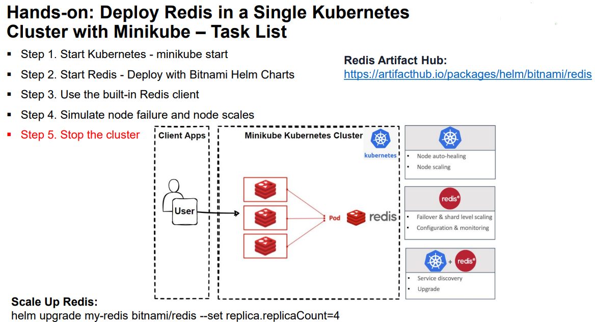
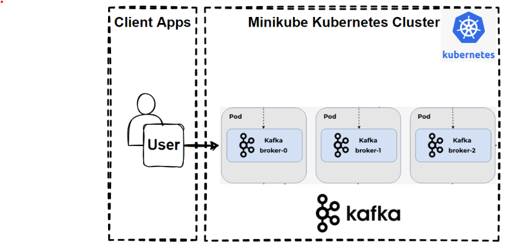
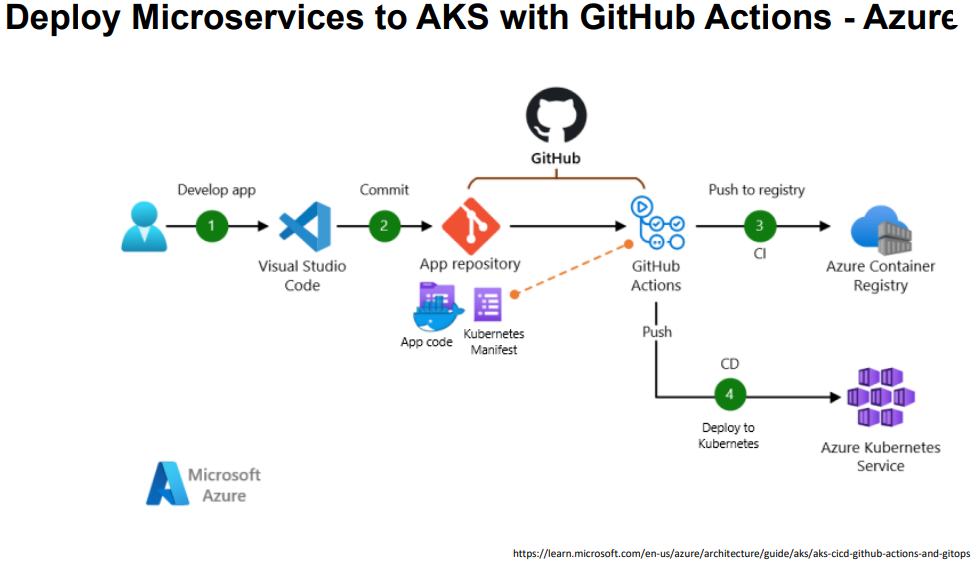

# Lecture Notes

## Create new xunit test project using bunit project template

Created xunit project in Visual Studio

NOTE: You can also create a new xunit test project that includes bunit

dotnet new bunit --framework xunit -o ProductServiceTests
dotnet sln .\CloudNative.sln add .\microservices\ProductServiceTests\ProductServiceTests.csproj
dotnet add .\ProductServiceTests.csproj reference ..\ProductService\ProductService.csproj

dotnet build ProductService.sln

## Automating build and test

[GitHub Action dotnet](https://docs.github.com/en/actions/automating-builds-and-tests/building-and-testing-net)

Next steps could be:

- Add a step to publish the project
- Add a step to deploy the project

## Customize Docker containers in Visual Studio

[Build/Debugging Containers in VS 2022](https://learn.microsoft.com/en-us/visualstudio/containers/container-build?view=vs-2022)
Learn how to customize your debug container and how Visual Studio uses this Dockerfile to build your images for faster debugging.

Create Dockerfile in csproj folder using Visual Studio Tools

```dockerfile
FROM mcr.microsoft.com/dotnet/aspnet:8.0 AS base
USER app
WORKDIR /app
EXPOSE 8080
EXPOSE 8081

FROM mcr.microsoft.com/dotnet/sdk:8.0 AS build
ARG BUILD_CONFIGURATION=Release
WORKDIR /src
COPY ["microservices/ProductService/ProductService.csproj", "microservices/ProductService/"]
RUN dotnet restore "./microservices/ProductService/./ProductService.csproj"
COPY . .
WORKDIR "/src/microservices/ProductService"
RUN dotnet build "./ProductService.csproj" -c $BUILD_CONFIGURATION -o /app/build

FROM build AS publish
ARG BUILD_CONFIGURATION=Release
RUN dotnet publish "./ProductService.csproj" -c $BUILD_CONFIGURATION -o /app/publish /p:UseAppHost=false

FROM base AS final
WORKDIR /app
COPY --from=publish /app/publish .
ENTRYPOINT ["dotnet", "ProductService.dll"]
```

Docker commands run by Visual Studio when you select 'Docker' debug

```powershell

docker build -f "C:\DEV\github.com\CloudNative\microservices\ProductService\Dockerfile" --force-rm -t productservice:dev --target base  --build-arg "BUILD_CONFIGURATION=Debug" --label "com.microsoft.created-by=visual-studio" --label "com.microsoft.visual-studio.project-name=ProductService" "C:\DEV\github.com\CloudNative"

docker run -dt -v "C:\Users\jpcas\vsdbg\vs2017u5:/remote_debugger:rw" -v "C:\Users\jpcas\AppData\Roaming\Microsoft\UserSecrets:/root/.microsoft/usersecrets:ro" -v "C:\Users\jpcas\AppData\Roaming\Microsoft\UserSecrets:/home/app/.microsoft/usersecrets:ro" -v "C:\Users\jpcas\AppData\Roaming\ASP.NET\Https:/root/.aspnet/https:ro" -v "C:\Users\jpcas\AppData\Roaming\ASP.NET\Https:/home/app/.aspnet/https:ro" -v "C:\Program Files\Microsoft Visual Studio\2022\Professional\MSBuild\Sdks\Microsoft.Docker.Sdk\tools\TokenService.Proxy\linux-x64\net6.0:/TokenService.Proxy:ro" -v "C:\Program Files\Microsoft Visual Studio\2022\Professional\MSBuild\Sdks\Microsoft.Docker.Sdk\tools\HotReloadProxy\linux-x64\net6.0:/HotReloadProxy:ro" -v "C:\Program Files\Microsoft Visual Studio\2022\Professional\Common7\IDE\CommonExtensions\Microsoft\HotReload:/HotReloadAgent:ro" -v "C:\DEV\github.com\CloudNative\microservices\ProductService:/app" -v "C:\DEV\github.com\CloudNative:/src/" -v "C:\Users\jpcas\.nuget\packages\:/.nuget/fallbackpackages" -e "ASPNETCORE_LOGGING__CONSOLE__DISABLECOLORS=true" -e "ASPNETCORE_ENVIRONMENT=Development" -e "DOTNET_USE_POLLING_FILE_WATCHER=1" -e "NUGET_PACKAGES=/.nuget/fallbackpackages" -e "NUGET_FALLBACK_PACKAGES=/.nuget/fallbackpackages" -P --name ProductService --entrypoint tail productservice:dev -f /dev/null
9545763849b964cb8df6fd933e230e8cdfe17420010ccf9d4b6ff5cdf7780fbe

docker rm -f 9545763849b964cb8df6fd933e230e8cdfe17420010ccf9d4b6ff5cdf7780fbe

```

## Customize Docker containers in VS Code

Create Dockerfile in csproj folder in VS Code

```dockerfile
# Use the official image as a parent image
FROM mcr.microsoft.com/dotnet/sdk:8.0 AS build

# Set the working directory
WORKDIR /source

# copy csproj and restore as distinct layers
COPY *.csproj ./
RUN dotnet restore

# copy and publish app and libraries
COPY . .
RUN dotnet publish -o /app

# Build runtime image
FROM mcr.microsoft.com/dotnet/aspnet:8.0
WORKDIR /app
COPY --from=build /app .

# Make sure the app binds to port 80
ENV ASPNETCORE_URLS http://*:80
EXPOSE 80

#set the entry point to the application
ENTRYPOINT ["dotnet", "ProductService.dll"]
```

Docker commands:

Create Docker Image for Product Microservices

Build Docker Image

Run command at same directory level of Dockerfile

```powershell
# Run command at same directory level of Dockerfile
docker build -t productservice .
#See a list of all images available on your machine
docker images
# same command exclude any lines that contain the word "k8s" and 'docker'
docker images --format "{{.Repository}}:{{.Tag}}" | Where-Object {$_ -notmatch 'k8s' -and $_ -notmatch 'docker'}

#Run Docker image: run detached mode (-d)
docker run -d -p 8080:80 --name productservicecontainer productservice
#Another good approach to run docker image:
#This command tells Docker to run a container in -it interactive mode
docker run -it --rm -p 8080:80 --name productservicecontainer productservice


#Check if the container is running by executing:
docker ps

#Open your browser and navigate to
http://localhost:8080/api/products

#Stop container
docker stop productservicecontainer
#Remove container
docker rm productservicecontainer
#Delete image
docker rmi -f productservice:latest

```

## Docker Vulnerability Checks

```powershell

#View a summary of image vulnerabilities and recommendations →
docker scout quickview local://productservice:latest
#View vulnerabilities →
docker scout cves local://productservice:latest
#View base image update recommendations →
docker scout recommendations local://productservice:latest
#Include policy results in your quickview by supplying an organization →
docker scout quickview local://productservice:latest --org <organization>
```

## Docker Learning about building .NET container images

[Learn about building .NET container images:](https://github.com/dotnet/dotnet-docker/blob/main/samples/README.md)

## Push to Docker Hub

> Step 1: Log in to Docker Hub
> Open a terminal and run the following command to log in to Docker Hub:

docker login

Enter your Docker Hub username and password when prompted.

Username: xxxx
Password:
Login Succeeded

> Step 2: Tag your Docker image

Find the IMAGE ID of your local Docker image by running:
docker images

Tag your Docker image with your Docker Hub username and the desired repository name:
docker tag productservice jpcassidy/productservice:latest

See tagged image
docker images

> Step 3: Push the Docker image to Docker Hub
> Push the tagged Docker image to your Docker Hub repository:

docker push jpcassidy/productservice:latest

Check
https://hub.docker.com/
See
https://hub.docker.com/repository/docker/jpcassidy/productservice/general

## Configure and Deploy ProductService to AWS AppRunner

[Download and Configure AWS CLI](https://docs.aws.amazon.com/cli/latest/userguide/getting-started-install.html)

Check AWS CLI
aws --version

[Configure AWS CLI](https://docs.aws.amazon.com/cli/latest/userguide/cli-authentication-user.html#cli-authentication-user-get)
aws configure

- Secret Access Key
- Access Key ID
- AWS Region
- Output format

[AWS Configure Commands](https://docs.aws.amazon.com/cli/latest/userguide/cli-configure-files.html)

- aws configure list


### Pushing Docker Image to Amazon Elastic Container Registry (ECR)

- Step 1: Create an Amazon ECR repository (name: productservice)
- Step 2: Authenticate Docker to your Amazon ECR registry

aws ecr get-login-password --region us-east-1 | docker login --username AWS --password-stdin xxxx.dkr.ecr.us-east-1.amazonaws.com/productservice

- Step 3: Build Docker image
  productservice:latest
- Step 4: Tag Docker image
  docker tag productservice:latest xxxx.dkr.ecr.us-east-1.amazonaws.com/productservice
- Step 5: Push your Docker image to Amazon ECR
  docker push xxxx.dkr.ecr.us-east-1.amazonaws.com/productservice:latest

- List images
  aws ecr list-images --repository-name productservice --output json --no-cli-pager

### Deploy ProductService Container to AWS Apprunner

- Step 1: Create a new service in AWS App Runner
- Step 2: Configure the container image
- Step 3: Configure the deployment settings
- Step 4: Review your configuration and create the service
- Step 5: Deploy to AWS App Runner that pull image from ECR

### Clear AWS Resources

- AWS App Runner
- AWS ECR and delete images
- Role – AppRunnerECRAccessRole

## Install Minikube and kubectl

- [Manually - Install Minikube](https://minikube.sigs.k8s.io/docs/start/)
  [Video - Install Minikube in Windows 10 via Docker Desktop](https://www.youtube.com/watch?v=u2684TT9XHo)
- [Install kubectl](https://kubernetes.io/docs/tasks/tools/install-kubectl/)
- Test to ensure the version of kubectl
  kubectl version -o json

### Can you run Kubernetes and MiniKube at same time on Docker Desktop on Windows 11

Yes, you can run both Kubernetes and Minikube at the same time on Docker Desktop on Windows 11. However, they will create separate Kubernetes clusters and won't interfere with each other.

Docker Desktop's Kubernetes feature and Minikube both create a local Kubernetes cluster on your machine. Docker Desktop's Kubernetes runs as part of the Docker Desktop application, while Minikube runs as a separate virtual machine or a Docker container, depending on the driver you choose.

Remember to manage your system resources (CPU, memory) wisely, as running both at the same time can be resource-intensive.

### How to install minikube on docker desktop on windows 11

To install Minikube on Docker Desktop on Windows 11, follow these steps:

1. Ensure Docker Desktop is installed and running.
2. Install Chocolatey, a package manager for Windows. Open PowerShell as an administrator and run:

```powershell
Set-ExecutionPolicy Bypass -Scope Process -Force; [System.Net.ServicePointManager]::SecurityProtocol = [System.Net.ServicePointManager]::SecurityProtocol -bor 3072; iex ((New-Object System.Net.WebClient).DownloadString('https://chocolatey.org/install.ps1'))
```

3. Install Minikube via Chocolatey:

```powershell
choco install minikube
```

4. Start Minikube:
   This command starts a Minikube cluster container using the Docker driver.

```powershell
minikube start --driver=docker

# Results
W1126 11:33:54.053549   15628 main.go:291] Unable to resolve the current Docker CLI context "default": context "default": context not found: open C:\Users\xxxx\.docker\contexts\meta\37a8eec1ce19687d132fe29051dca629d164e2c4958ba141d5f4133a33f0688f\meta.json: The system cannot find the path specified.
😄  minikube v1.32.0 on Microsoft Windows 11 Pro 10.0.22631.2787 Build 22631.2787
✨  Using the docker driver based on user configuration
📌  Using Docker Desktop driver with root privileges
👍  Starting control plane node minikube in cluster minikube
🚜  Pulling base image ...
💾  Downloading Kubernetes v1.28.3 preload ...
    > preloaded-images-k8s-v18-v1...:  403.35 MiB / 403.35 MiB  100.00% 70.39 M
    > gcr.io/k8s-minikube/kicbase...:  453.90 MiB / 453.90 MiB  100.00% 51.02 M
🔥  Creating docker container (CPUs=2, Memory=16300MB) ...
🐳  Preparing Kubernetes v1.28.3 on Docker 24.0.7 ...
    ▪ Generating certificates and keys ...
    ▪ Booting up control plane ...
    ▪ Configuring RBAC rules ...
🔗  Configuring bridge CNI (Container Networking Interface) ...
🔎  Verifying Kubernetes components...
    ▪ Using image docker.io/kubernetesui/dashboard:v2.7.0
    ▪ Using image docker.io/kubernetesui/metrics-scraper:v1.0.8
    ▪ Using image gcr.io/k8s-minikube/storage-provisioner:v5
💡  Some dashboard features require the metrics-server addon. To enable all features please run:

        minikube addons enable metrics-server

🌟  Enabled addons: storage-provisioner, default-storageclass
🏄  Done! kubectl is now configured to use "minikube" cluster and "default" namespace by default
```

5. Verify the installation:

```powershell
minikube status
```

6. Check MiniKube Cluster

```powershell
kubectl cluster-info
kubectl get po -A
```

NOTE: if you have Kubernetes already installed in Docker-Desktop follow these instructions to set minikube configuration in docker cli

How to set kubectl to use minikube configuration in docker cli?

To set kubectl to use Minikube's configuration in Docker CLI, you can use the minikube kubectl command or set the Kubernetes context to Minikube. Here's how you can do it:

To use minikube kubectl, you can run your commands like this:

```powershell
minikube kubectl -- get po -A
```

7. To set the Kubernetes context to Minikube, use the following command:

```powershell
kubectl config use-context minikube
# TO CHANGE BACK TO docker-desktop
kubectl config use-context docker-desktop
```

8. See dashboard

```powershell
minikube dashboard

#Results
W1126 12:11:45.207027    2436 main.go:291] Unable to resolve the current Docker CLI context "default": context "default": context not found: open C:\Users\jpcas\.docker\contexts\meta\37a8eec1ce19687d132fe29051dca629d164e2c4958ba141d5f4133a33f0688f\meta.json: The system cannot find the path specified.
🔌  Enabling dashboard ...
    ▪ Using image docker.io/kubernetesui/metrics-scraper:v1.0.8
    ▪ Using image docker.io/kubernetesui/dashboard:v2.7.0
💡  Some dashboard features require the metrics-server addon. To enable all features please run:

        minikube addons enable metrics-server


🤔  Verifying dashboard health ...
🚀  Launching proxy ...
🤔  Verifying proxy health ...
🎉  Opening http://127.0.0.1:63420/api/v1/namespaces/kubernetes-dashboard/services/http:kubernetes-dashboard:/proxy/ in your default browser...
```

After running this command, kubectl commands will interact with the Minikube cluster.

#### Stop and Delete MiniKube

This should delete the .minikube and .kube directories usually under:
C:\users\{user}\.minikube
C:\users\{user}\.kube

```powershell
minikube stop
minikube delete
choco uninstall minikube
choco uninstall kubectl
```

## Kubernetes Configuration Best Practices for Containers

### ASP.NET Container Expose Port - CONFIGURE TO LISTEN - 0.0.0.0:8080

#### CONFIGURE Container Expose Port TO LISTEN - 0.0.0.0:8080

- Edit Program.cs

```csharp
var builder = WebApplication.CreateBuilder(args);

// Add services to the container.
builder.Services.AddSingleton<List<Product>>();

	// Add the following for Kubernetes Deployment
	var port = Environment.GetEnvironmentVariable("PORT") ?? "8080";
	var url = $"http://0.0.0.0:{port}";
	builder.WebHost.UseUrls(url);

var app = builder.Build();
```

- dockerfile > [add ENV varible into DockerFile](https://github.com/dotnet/dotnet-docker/issues/3968)

```dockerfile
"environmentVariables": {
"ASPNETCORE_URLS": "https://+:443;http://+:80",
"ASPNETCORE_HTTPS_PORT": "44360"
},
```

- bash - [k8s deployment ENV variable inject](https://www.youtube.com/watch?v=63FLcPHUCPM)

```bash
kestrel**endpoints**http\_\_url
http://0.0.0.0:80
```

#### Build and Deploy Docker Image to Docker Hub

Build Image

```powershell
docker build -t productservice .
```

Run Docker Image
You can run your app in a container using the following command:

```powershell
docker run -d -p 8080:80 --name productservicecontainer productservice
```

Hit Endpoint:
http://localhost:8080/api/products

Tag your Docker image with your Docker Hub username and the desired repository name:

```powershell
docker tag productservice jpcassidy/productservice:latest
```

Push the tagged Docker image to your Docker Hub repository:

```powershell
docker push jpcassidy/productservice:latest
```

### Create POD

#### While you can create standalone Pods on Kubernetes, it is not recommended

because Pods are the lowest-level abstraction in Kubernetes.
▪ Lack of self-healing
If a Pod fails, is terminated, or becomes unhealthy, it will not be automatically
replaced. In contrast, higher-level abstractions like Deployments automatically
manage the desired number of replicas and replace any failed Pods.
▪ No scaling support
Need to manually create and manage multiple Pod YAML files to scale your
application. Deployments make scaling easy by allowing you to simply update
the desired number of replicas.
▪ Should make the Pods Resilient with Deployments

#### Creating a Pod Definition product-pod.yaml

product-pod.yaml

> Open 2. terminal to watch created pods on K8s

    kubectl get pods -w

> Apply the configuration

    kubectl apply -f product-pod.yaml

> See Watch

kubectl get pods -w
NAME READY STATUS RESTARTS AGE
my-app-pod 0/1 Pending 0 0s
my-app-pod 0/1 Pending 0 0s
my-app-pod 0/1 ContainerCreating 0  
my-app-pod 1/1 Running 0

> kubectl get pod
> NAME READY STATUS RESTARTS AGE
> my-app-pod 1/1 Running 0 63s

> Expose the Pod

    kubectl port-forward product-pod 8080:8080

Forwarding from 127.0.0.1:8080 -> 8080
Forwarding from [::1]:8080 -> 8080

You can now access the microservice at http://localhost:8080.

> SEE DEPLOYED MICROSERVICE ON K8S WITH POD

http://localhost:8080/api/products

> Stop Pod

    CTRL+C

> Clean Up

kubectl delete pod product-pod
or
kubectl delete -f .\product-pod.yaml

#### Create and Apply Deployment on Kubernetes k8s/product-deploy.yaml

product-deploy.yaml

Open 2. terminal to watch created pods on K8s
kubectl get pods -w

> Apply the configuration

    kubectl apply -f product-deploy.yaml

> See Watch

kubectl get pods -w
NAME READY STATUS RESTARTS AGE
my-app-pod 0/1 Pending 0 0s
my-app-pod 0/1 Pending 0 0s
my-app-pod 0/1 ContainerCreating 0  
my-app-pod 1/1 Running 0

> kubectl get pod
> NAME READY STATUS RESTARTS AGE
> my-app-pod 1/1 Running 0 63s

> > Expose the Pod

#### Create and Apply a Service in Kubernetes k8s/product-service.yaml

roduct-service.yaml

> Apply the configuration

```powershell
kubectl apply -f product-service.yaml
```

> See all

```powershell
kubectl get all
NAME                           READY   STATUS    RESTARTS   AGE
pod/product-7b7c849898-chzr6   1/1     Running   0          17m
pod/product-7b7c849898-hgkzm   1/1     Running   0          17m
pod/product-7b7c849898-kwrs6   1/1     Running   0          17m

NAME                      TYPE           CLUSTER-IP      EXTERNAL-IP   PORT(S)          AGE
service/kubernetes        ClusterIP      10.96.0.1       <none>        443/TCP          22h
service/product-service   LoadBalancer   10.98.131.168   <pending>     8080:31677/TCP   4m57s

NAME                      READY   UP-TO-DATE   AVAILABLE   AGE
deployment.apps/product   3/3     3            3           17m

NAME                                 DESIRED   CURRENT   READY   AGE
replicaset.apps/product-7b7c849898   3         3         3       17m
```

> Notice the service/product-service --type argument has a value of LoadBalancer.
> This service type is implemented by the cloud-controller-manager which is part of the Kubernetes control plane.

> Expose the Service
> To invoke our pod with this service definition, we need a tunnel for K8s LoadBalancer IP.

```powershell
kubectl port-forward service/product-service 7080:8080
```

> SEE RESULT

http://127.0.0.1:7080/api/products

> Expose Service with Minikube

First close port-forward service - CTRL+C
Run the following command to expose the service with Minikube:

```powershell
minikube service product-service

|-----------|-----------------|-------------|---------------------------|
| NAMESPACE |      NAME       | TARGET PORT |            URL            |
|-----------|-----------------|-------------|---------------------------|
| default   | product-service |        8080 | http://192.168.49.2:31677 |
|-----------|-----------------|-------------|---------------------------|
🏃  Starting tunnel for service product-service.
|-----------|-----------------|-------------|------------------------|
| NAMESPACE |      NAME       | TARGET PORT |          URL           |
|-----------|-----------------|-------------|------------------------|
| default   | product-service |             | http://127.0.0.1:53668 |
|-----------|-----------------|-------------|------------------------|
🎉  Opening service default/product-service in default browser...
❗  Because you are using a Docker driver on windows, the terminal needs to be open to run it.
```

#### Combined Way of Creating Deployment and Services for Microservices - product.yaml

Apply the configuration

```powershell
kubectl apply -f .\product.yaml

deployment.apps/product unchanged
service/product-service unchanged
```

Delete and re-create your deployment and service objects with kubectl delete command

```powershell
kubectl delete -f .\product.yaml
```

#### Create Ingress for External Access of Microservice

No longer need a service type of LoadBalancer since the service does not need to be accessible from the internet.
It only needs to be accessible from the Ingress Controller (internal to the cluster)
so we can change the service type to ClusterIP.

Update your service.yaml file to look like this:

    Remove type
    Create Ingress into product.yaml file

We have created Ingress object and referring to our service object which is product-service.
and host address is product.local

> So we should add this dns address into our host file.

Update your hosts file (/etc/hosts on Linux and macOS or C:\Windows\System32\drivers\etc\hosts on Windows) to add the following line:

First get IP of minikube
minikube ip
192.168.49.2

> Add this line:

Added by Minikube Custom Domain
192.168.49.2 product.local

> Active Ingress addons into our minikube installment.

See all list
minikube addons list

Activate Ingress for our local minikube
minikube addons enable ingress

> Re-apply the app service manifest.
> Re-create all objects:

kubectl delete -f product.yaml
kubectl apply -f product.yaml

> See all
> kubectl get all

kubectl get ingress
NAME CLASS HOSTS ADDRESS PORTS AGE
product-ingress nginx product.local 192.168.49.2 80 3m29s

> Access dns adress

product.local

> SEE RESULT:
> http://product.local/api/products

list ingress pods:
kubectl get pods -n ingress-nginx

describe pod:
kubectl describe pod ingress-nginx-controller-7c6974c4d8-nlhqk -n ingress-nginx

view logs from ingress controller:
kubectl logs ingress-nginx-controller-7c6974c4d8-nlhqk -n ingress-nginx

#### Create ConfigMaps and Secrets for Microservice

Create a ConfigMap to store a basic configuration parameter, such as the log_level.
Create a file named log-level-configmap.yaml

GOTO
product.yaml

---

apiVersion: v1
kind: ConfigMap
metadata:
name: log-level-configmap
data:
log_level: "Information"

---

Create the Secret
use a Secret to create api-key secret inside the pod.
encode the secret value in base64:

> open bash on vscode

echo -n 'product-api-key' | base64
cHJvZHVjdC1hcGkta2V5

> Copy the output and create secret into product.yaml file

---

apiVersion: v1
kind: Secret
metadata:
name: api-key-secret
type: Opaque
data:
api_key: cHJvZHVjdC1hcGkta2V5

> > Update the deployment object to use the ConfigMap and Secret values as environment variables in the container:

--product.yaml

added below part into deployment:

env: - name: LOG_LEVEL
valueFrom:
configMapKeyRef:
name: log-level-configmap
key: log_level - name: API_KEY
valueFrom:
secretKeyRef:
name: api-key-secret
key: api_key

See that our pod injected 2 ENV Variables, 1 from configmap another from secret.

> > Apply the updated all Deployment:\k8s>

    kubectl apply -f .\product.yaml

    deployment.apps/product configured
    service/product-service unchanged
    ingress.networking.k8s.io/product-ingress unchanged
    configmap/log-level-configmap created
    secret/api-key-secret created

> Check

kubectl get secret
NAME TYPE DATA AGE
api-key-secret Opaque 1 27s

kubectl get configmap
NAME DATA AGE
kube-root-ca.crt 1 25h
log-level-configmap 1 40s

> > Modify .NET application to read these environment variables and use them as needed.
> > These are typical ENV variables that we can use into our application.

goto Program.cs

Show how to get these values:

var builder = WebApplication.CreateBuilder(args);

var logLevel = Environment.GetEnvironmentVariable("LOG_LEVEL");
var apiKey = Environment.GetEnvironmentVariable("API_KEY");

So we can ConfigureLogging as per these logLevel and add api key into controllers.

#### Scale a Container Instance in Kubernetes

Start with watch pods
kubectl get pod -w

Use the kubectl scale command to update the deployment with a number of pods to create.
kubectl scale --replicas=5 deployment/product

> See watch - new 2 pod creating
> product-deploy-5d5ccb7569-khfs6 0/1 ContainerCreating 0 0s
> product-deploy-5d5ccb7569-qkrzn 0/1 ContainerCreating 0 0s

> See latest pods

    kubectl get pod

> > if there's a failure Kubernetes will automatically restart the pods that were running before the failure.
> > Let's see this resilience in action by deleting pod and then verifying that Kubernetes has restarted it.

kubectl get pods
product-deploy-5d5ccb7569-khfs6 0/1 ContainerCreating 0 0s
product-deploy-5d5ccb7569-qkrzn 0/1 ContainerCreating 0 0s

> Delete the pod by using the kubectl delete command.
> kubectl delete pod product-5b6cc765c4-hjpx4

> see
> immediately stating the pod has been deleted.
> kubectl get pods

random string following the pod name has changed.
Indicating the pod is a new instance.

> > To scale the instance back down, run the following command.

    kubectl scale --replicas=1 deployment/product

See WATCH

product-deploy-5d5ccb7569-j9gvl 0/1 Terminating 0 2m26s
product-deploy-5d5ccb7569-khfs6 0/1 Terminating 0 78s
product-deploy-5d5ccb7569-khfs6 0/1 Terminating 0 78s
product-deploy-5d5ccb7569-khfs6 0/1 Terminating 0 78s
product-deploy-5d5ccb7569-4dcr8 0/1 Terminating 0 2m27s
product-deploy-5d5ccb7569-4dcr8 0/1 Terminating 0 2m27s
product-deploy-5d5ccb7569-4dcr8 0/1 Terminating 0 2m27s
product-deploy-5d5ccb7569-qkrzn 0/1 Terminating 0 78s
product-deploy-5d5ccb7569-qkrzn 0/1 Terminating 0 79s

Both of these approaches modify the running configuration
manually run kubectl scale
or change replica number.

Solution: Auto-Scaling

#### Kubernetes Deploy and Service with Minikube

> Start
> minikube start

> Interact with your cluster
> minikube dashboard

> Deploy applications
> Create a sample deployment and expose it on port 8080:
> kubectl create deployment hello-minikube --image=jpcassidy/productservice:latest
> kubectl expose deployment hello-minikube --type=NodePort --port=8080

> Check service
> The easiest way to access this service is to let minikube launch a web browser for you:

    kubectl get services hello-minikube

    minikube service hello-minikube

SEE - WORKED !
http://127.0.0.1:62162/api/products

> Alternatively, use kubectl to forward the port:

    kubectl port-forward service/hello-minikube 7080:8080

Your application is now available at http://localhost:7080/.

SEE- WORKED !
http://localhost:7080/api/products

#### Clean up Minikube resources

> 1
> Delete host address

    C:\Windows\System32\drivers\etc\hosts

> 2

    kubectl delete deployment my-app
    kubectl delete service my-app-service
    kubectl delete pod my-app-pod
    kubectl delete ingress my-app-ingress

Since we can't just delete the pods, we have to delete the deployments.
kubectl delete -f ./product.yaml

> 3
> Finally, stop Minikube with the command:

    minikube stop

## Helm Charts

### Install Helm

```powershell
choco install kubernetes-helm
The install of kubernetes-helm was successful.
  Software installed to 'C:\ProgramData\chocolatey\lib\kubernetes-helm\tools'
```

Optional Instructions - Download and install the Helm CLI
[Youtube Video - Install Helm On Windows](https://www.youtube.com/watch?v=2fop7rvHrac)
▪ https://helm.sh/docs/intro/install/
▪ https://github.com/helm/helm/releases
▪ Download and un-zip
▪ Create C:/tools folder
▪ Add path into ENV variables

### Create Helm Chart for ProductService

#### Hands-on Lab: Deploy Product Microservices with Helm Charts

Create a simple Helm chart for the Product microservice we previously deployed to Kubernetes.

NOTE: this will create a helm folder in ~\orchestrators\helm\ folder

> Create a new Helm chart:
> Run the following command to create a new Helm chart named productservice:
> helm create productservice

This command will generate a new directory called productservice with the basic structure of a Helm chart.

> See folder structure

helm/productservice

    see values.yaml, Chart.yaml ...

> > Update the chart metadata:
> > Open the Chart.yaml file in the productservice directory,
> > and update it with the relevant information about Product microservice:

apiVersion: v2
name: product-app
description: A Helm chart for Product microservice
type: application
version: 0.1.0
appVersion: 1.0.0

> > Examine Generated files:

Charts.yaml
Values.yaml
Templates folder

> > Update the default values:
> > Open the values.yaml file in the productservice directory,
> > and set the default values for the deployment, service, and container image:

replicaCount: 3

image:
repository: mehmetozkaya/productservice
pullPolicy: IfNotPresent

#### Overrides the image tag whose default is the chart appVersion.

tag: "latest"
...
service:
type: LoadBalancer
port: 8080
targetPort: 8080

...
These values are automatically map the deployment and service yaml files under templates folder.

> > See how organize template parameters:
> > image: "{{ .Values.image.repository }}:{{ .Values.image.tag | default .Chart.AppVersion }}"
> > imagePullPolicy: {{ .Values.image.pullPolicy }}

> > Update the templates:
> > goto template file and see the content that will replace.

1 - service.yaml file
put targetPort: {{ .Values.service.targetPort }}

ports: - port: {{ .Values.service.port }}
targetPort: {{ .Values.service.targetPort }}
protocol: TCP

2- remove health checks
since we expose microservices
api/products
we can remove or change this
otherwise our pods wont be start due to not become healty state

> The idea is that when we generate k8s files

    that we already developed before.

see k8s folder
see deployment and service.yaml file

> > Install the chart:
> > Run the command to install the Helm chart into your Kubernetes cluster:
NOTE: run command from: ~/helm/ folder

```powershell
helm install productservice-release ./productservice
NAME: productservice-release
LAST DEPLOYED: Wed Nov 29 09:31:00 2023
NAMESPACE: default
STATUS: deployed
REVISION: 1
NOTES:
1. Get the application URL by running these commands:
     NOTE: It may take a few minutes for the LoadBalancer IP to be available.
           You can watch the status of by running 'kubectl get --namespace default svc -w productservice-release'
  export SERVICE_IP=$(kubectl get svc --namespace default productservice-release --template "{{ range (index .status.loadBalancer.ingress 0) }}{{.}}{{ end }}")
  echo http://$SERVICE_IP:8080
  ```

> > Verify the deployment:
    helm list

You should see your productservice-release in the list of deployed releases.

Check deployed resources:
kubectl get svc,deploy,pods
kubectl get all

> > Access the application:
> > To access the application, we'll need the create tunnel of the service with using kubectl port-forward command or minikube service command.

Port fwd
minikube service productservice-release

See products url
http://127.0.0.1:50643/api/products

> > Alternatively, Access the application by using kubectl to forward the port:

    kubectl port-forward service/productservice-release 7080:8080

Your application is now available at http://localhost:7080/.

See products url
http://localhost:7080/api/products

> Uninstall the chart:
> When you are done testing your application, you can uninstall the release by running:

    helm uninstall productservice-release

See pods removed:
kubectl get all

## Pillar 4: Deploy Microservices to Kubernetes with Service Mesh Istio and Envoy

- Getting Started with Istio and Envoy with Minikube
- Download and install Istio Service Mesh onto Minikube K8s cluster 
- Deploy the microservices application on Kubernetes with Istio Service Mesh 
- Open the application to outside traffic with Istio Ingress Gateway 
- Deploy the Kiali dashboard, along with Prometheus, Grafana, and Jaeger


### Download and Install Istio Service Mesh onto Minikube K8s cluster

----
>1
Go to the Istio release page to download the installation file for your OS, 
	or download and extract the latest release automatically (Linux or macOS):

	https://istio.io/latest/docs/setup/getting-started/#download
	https://github.com/istio/istio/releases	

	istio-1.xx-win.zip	

>2
Move to the Istio package directory. 
For example, if the package is istio-1.17.2:

$ cd istio-1.17.2

The installation directory contains:

Sample applications in samples/
The istioctl client binary in the bin/ directory.

C:\Users\PC\Downloads\istio-1.17.2-win\istio-1.17.2

>3
Add the istioctl client to your path (Linux or macOS):

$ export PATH=$PWD/bin:$PATH

Windows

Move 
	C:\Users\PC\Downloads\istioctl-1.17.2-win
		istioctl.exe

to our
	C:/tools folder
		istioctl.exe

>
Open wt
	istioctl

### Install Istio Service Mesh

----
>0
Make sure that you have installed minikube and kubectl.

Start Docker
minikube start

kubectl get pod
kubectl get all

>1
For this installation, we use the demo configuration profile. 

Run Command:
	istioctl install --set profile=demo -y

>2
Add a namespace label to instruct Istio to automatically inject Envoy sidecar proxies when you deploy your application later:

Run Command:
	kubectl label namespace default istio-injection=enabled

namespace/default labeled

### Deploy the Microservices Application

----
>1
Deploy the Bookinfo sample application:

Run Command:
	kubectl apply -f samples/bookinfo/platform/kube/bookinfo.yaml

	kubectl apply -f .\bookinfo.yaml

>2
The application will start. 
As each pod becomes ready, the Istio sidecar will be deployed along with it.

Run Command:
	kubectl get services

and

Run Command:
	kubectl get pods

>3
Verify everything is working correctly up to this point. 
Run this command to see if the app is running inside the cluster and serving HTML pages by checking for the page title in the response:

bash script

$ kubectl exec "$(kubectl get pod -l app=ratings -o jsonpath='{.items[0].metadata.name}')" -c ratings -- curl -sS productpage:9080/productpage | grep -o "<title>.*</title>"

```html
<title>Simple Bookstore App</title>
```

### Open the Application to Outside Traffic

----
>1
Create file bookinfo-gateway.yaml

copy-paste
	https://raw.githubusercontent.com/istio/istio/release-1.17/samples/bookinfo/networking/bookinfo-gateway.yaml

>2
Associate this application with the Istio gateway:

Run Command:
kubectl apply -f samples/bookinfo/networking/bookinfo-gateway.yaml

kubectl apply -f .\bookinfo-gateway.yaml

gateway.networking.istio.io/bookinfo-gateway created
virtualservice.networking.istio.io/bookinfo created

>3
Ensure that there are no issues with the configuration:

```bash
istioctl analyze
✔ No validation issues found when analyzing namespace: default.
```

>4
Determining the ingress IP and ports

Run this command in a new terminal window to start a Minikube tunnel that sends traffic to your Istio Ingress Gateway. 
This will provide an external load balancer, EXTERNAL-IP, for service/istio-ingressgateway.

Run Command:
minikube tunnel

>5
Set the ingress host and ports:
Set the INGRESS_HOST and INGRESS_PORT variables for accessing the gateway. Use the tabs to choose the instructions for your chosen platform:
Open git bash command and check below parameters:

export INGRESS_HOST=$(kubectl -n istio-system get service istio-ingressgateway -o jsonpath='{.status.loadBalancer.ingress[0].ip}')
export INGRESS_PORT=$(kubectl -n istio-system get service istio-ingressgateway -o jsonpath='{.spec.ports[?(@.name=="http2")].port}')
export SECURE_INGRESS_PORT=$(kubectl -n istio-system get service istio-ingressgateway -o jsonpath='{.spec.ports[?(@.name=="https")].port}')

Ensure an IP address and ports were successfully assigned to each environment variable:

echo "$INGRESS_HOST"
127.0.0.1

echo "$INGRESS_PORT"
80

echo "$SECURE_INGRESS_PORT"
443


>6
Set GATEWAY_URL:

export GATEWAY_URL=$INGRESS_HOST:$INGRESS_PORT

Ensure an IP address and port were successfully assigned to the environment variable:

echo "$GATEWAY_URL"
192.168.99.100:32194

127.0.0.1:80

>7
Verify external access
Confirm that the Bookinfo application is accessible from outside.
Run the following command to retrieve the external address of the Bookinfo application.

echo "http://$GATEWAY_URL/productpage"

Paste the output from the previous command into your web browser.
open chrome
	http://127.0.0.1/productpage

See page came
	The Comedy of Errors !

### View the dashboard - Deploy the Kiali dashboard, along with Prometheus, Grafana, and Jaeger
----
>1
We should download full folder on github, we can also do copy paste one-by-one all folders, but there is a short way to implement all folder.

Downloaded path:
	https://github.com/istio/istio/tree/release-1.17/samples/addons

Download folder:
	https://download-directory.github.io/

>2
create "addons" folder under lecture folder  on vscode

copy paste all items into github to vs code folder
	https://github.com/istio/istio/tree/release-1.17/samples/addons

	kiali.yaml
	prometheus.yaml
	jaeger.yaml
	grafana.yaml

> Read
	Readme File

>
goto path
	copy and paste addons folder of k8s

>
Examine files
	kiali.yaml
	prometheus.yaml
	jaeger.yaml
	grafana.yaml

So now we are ready to apply this whole folder into our minikube kubernetes cluster over the istio service mesh.

>>
Install Kiali and the other addons and wait for them to be deployed.

Run Command:
kubectl apply -f .\addons\
kubectl rollout status deployment/kiali -n istio-system

Waiting for deployment "kiali" rollout to finish: 0 of 1 updated replicas are available...
deployment "kiali" successfully rolled out

>
Access the Kiali dashboard.

Run Command:
istioctl dashboard kiali

### Analysis the Dashboard
----
>
Open new wt:
minikube tunnel

http://127.0.0.1/productpage

>
Open new wt:
istioctl dashboard kiali

>
To send a 100 requests to the productpage service, use the following command:

goto bash script
for i in $(seq 1 100); do curl -s -o /dev/null "http://http://127.0.0.1/productpage"; done

## Pillar 5: Backing Services - Data Management, Caching, Message Brokers

### Hands-on: Deploy Cloud-Native CockroachDB Database on a Kubernetes Cluster with Minikube

#### Deploy CockroachDB in a Single Kubernetes Cluster with Kubernetes Operator and minikube

[Github - CockroachDB Kubernetes Operator](https://github.com/cockroachdb/cockroach-operator)

Install the Operator
Apply the custom resource definition (CRD) for the Operator:

Run Command:
kubectl apply -f https://raw.githubusercontent.com/cockroachdb/cockroach-operator/v2.10.0/install/crds.yaml

Step 1 Deploy CockroachDB in a Single Kubernetes Cluster with Kubernetes Operator and minikube
Step 2 Start CockroachDB - Initialize the cluster - Apply the custom resource of CockroachDB
Step 3. Use the built-in SQL client
Step 4. Access the DB Console
Step 5. Simulate node failure and node scales
Step 6. Stop the cluster

### Hands-on: Building RESTful Microservices with AWS Lambda, API Gateway and DynamoDB

- Create a Serverless API that creates, reads, updates, and deletes items from a DynamoDB table.
- Create a DynamoDB table using the DynamoDB console.
- create a Lambda function using the AWS Lambda console.
- Create an REST API using the API Gateway console. Lastly, we test your API.
- Clients send request our microservices by making HTTP API calls.
- Amazon API Gateway hosts RESTful HTTP requests and responses to customers.
- AWS Lambda contains the business logic to process incoming API calls and leverage DynamoDB as a persistent storage.
- Amazon DynamoDB persistently stores microservices data and scales based on demand.

### Hands-on: Deploy Redis Cache on a Kubernetes Cluster

▪ Step 1. Start Kubernetes - minikube start
▪ Step 2. Start Redis - Deploy with Bitnami Helm Charts
▪ Step 3. Use the built-in Redis client
▪ Step 4. Simulate node failure and node scales
▪ Step 5. Stop the cluster



### Hands-on: Deploy Kafka Message Broker on a Kubernetes Cluster

▪ Step 1. Start Kubernetes - minikube start
▪ Step 2. Start Kafka - Deploy with Bitnami Helm Charts
▪ Step 3. Use the built-in Kafka client - Publish and Subscribe Topic
▪ Step 4. Simulate node failure and node scales
▪ Step 5. Stop the cluster

[Kafka Artifact Hub](https://artifacthub.io/packages/helm/bitnami/kafka)



## Pillar6: Scalability: Kubernetes Horizontal Pod Autoscaler(HPA) and KEDA

[Enable Kubernetes Metrics Server on Docker Desktop](https://dev.to/docker/enable-kubernetes-metrics-server-on-docker-desktop-5434)

### Install KEDA using Helm

See Kedacore ArtifactHub
https://artifacthub.io/packages/helm/kedacore/keda

Add the KEDA Helm repo:
Run Command:
helm repo add kedacore https://kedacore.github.io/charts

Update the Helm repo:
Run Command:
helm repo update

Install KEDA using Helm:
Run Command:
kubectl create namespace keda
helm install keda kedacore/keda --namespace keda

Verify KEDA Operators:
Run Command:
kubectl get pod,svc,deployment --namespace keda

### Deploy Kafka

For this example, we will deploy Kafka using Helm:

See Kafka on ArtifactHub:
https://artifacthub.io/packages/helm/bitnami/kafka

Run Command:
helm repo add bitnami https://charts.bitnami.com/bitnami
helm repo update
kubectl create namespace kafka
helm install kafka bitnami/kafka --namespace kafka

Verify Kafka Operators:
Run Command:
kubectl get pod,svc,deployment --namespace kafka

Wait for a few minutes until Kafka is up and running.

Step 4: Deploy a Sample Consumer Application

We will deploy a kafka consumer app to read and process Kafka messages on-demand using KEDA.
Create a deployment file named consumer-deployment.yaml:

apiVersion: apps/v1
kind: Deployment
metadata:
  name: consumer-deployment
spec:
  replicas: 0 # Initially set to 0 as KEDA will scale this
  selector:
    matchLabels:
      app: consumer
  template:
    metadata:
      labels:
        app: consumer
    spec:
      containers:
      - name: consumer
        image: bitnami/kafka:latest
        command:
        - /bin/bash
        - -c
        - |
          echo "Starting consumer..."
          kafka-console-consumer.sh --bootstrap-server kafka.kafka.svc.cluster.local:9092 --topic mytopic

See that we use kafka image and run kafka-consumer sh command to read mytopic data from kafka.
NOTE THAT REPLICA = 0 
That means we would like to create pods as per on-demand of kafka topic messages.

Apply the deployment:
Run Command:
kubectl apply -f consumer-deployment.yaml

Step 5: Configure KEDA to Scale Based on Kafka Topic Length
Run Command:
Create a kafka-scaledobject.yaml file:
  goto kafka-scaledobject.yaml

Apply the ScaledObject configuration:
Run Command:
kubectl apply -f kafka-scaledobject.yaml

Verify
Run Command:
kubectl get scaledobject

Step 6: Simulate Load

See that there is no any pod about kafka consumer yet, because there is no message into our kafka

Run Command:
kubectl get pod

This is our kafka cluster:
kubectl get pod -n kafka

Now let’s simulate some load by producing messages to the Kafka topic: --before at observe the scaling Step7
Run Command:

kubectl run kafka-producer -ti --image=bitnami/kafka --namespace=kafka -- bash

#### Inside the container run

--- WAIT for a while to connect kafka

kafka-console-producer.sh --broker-list kafka.kafka.svc.cluster.local:9092 --topic mytopic

#### Now type messages and send

If you close your terminal - you can attach producer again and send random message
PS C:\Users\PC> kubectl attach kafka-producer -ti --namespace=kafka
If you don't see a command prompt, try pressing enter.
I have no name!@kafka-producer:/$ kafka-console-producer.sh --broker-list kafka.kafka.svc.cluster.local:9092 --topic mytopic

Step 7: Observe the Scaling
You can observe the autoscaling by looking at how the number of pods changes based on the number of messages in the Kafka topic.

Run Command:
kubectl get pods -w

NAME                              READY   STATUS    RESTARTS        AGE
hello-minikube-5b8bbb84c7-6grrn   1/1     Running   10 (131m ago)   57d
consumer-deployment-765b46f87-4xfnl   0/1     Pending   0               0s
consumer-deployment-765b46f87-4xfnl   0/1     Pending   0               0s
consumer-deployment-765b46f87-4xfnl   0/1     ContainerCreating   0               0s
consumer-deployment-765b46f87-4xfnl   1/1     Running             0               19s

See that consumer pods are autoscale based on Kafka topic messages.

Step 8: Clean Up
Once you are done with the lab, you can delete the resources created:

Close all terminals

kubectl delete -f consumer-deployment.yaml
kubectl delete -f kafka-scaledobject.yaml
helm uninstall kafka --namespace kafka
kubectl delete namespace kafka
helm uninstall keda --namespace keda
kubectl delete namespace keda

This will delete the KEDA ScaledObject and the deployment, respectively. Finally, stop the Minikube cluster by running:

minikube stop

This hands-on lab has shown you how to use Kubernetes Event-Driven Autoscaling (KEDA) to scale pods in a Kubernetes cluster using Minikube.
We used KEDA to autoscale pods based on the number of messages in a Kafka topic in a Minikube Kubernetes cluster.

### Hands-on: Deploying Microservices on Amazon EKS Fargate

- Step 1. Installing or updating eksctl to interact Kubernetes Cluster on EKS
- Step 2. Create an EKS Cluster with Fargate using eksctl
- Step 3. Deploy Nginx microservices on EKS Cluster w/Fargate using eksctl
- Step 4. Create an ECR repository and Push Docker Image to Container Registry
- Step 5. Deploy Product microservices on EKS Cluster w/Fargate using eksctl
- Step 6. AWS Fargate Auto-scale Deploy Product microservices on EKS
- Clear Resources - IMPORTANT

## Pillar7: Devops, CI/CD, IaC and GitOps

### Deploy Microservices to AKS with GitHub Actions

- Create a Workflow File: Create a .github/workflows directory in your repository. This file will define the GitHub Actions workflow.
- Define Workflow Steps: Inside the workflow file, define the steps GitHub Actions should take. i.e. Checkout code, build container image, push registry..
  - Check Out Code: Use the actions/checkout action
  - Set Up Environment: Docker to build container images.
  - Build Container Image: Build the Docker image for your microservice
  - Push Image to Container Registry: push it to a container registry like Docker Hub
  - Configure Kubernetes CLI: Set up kubectl in the runner environment.
  - Deploy to Kubernetes: Apply your Kubernetes manifests to your cluster.
- Commit and Push: Commit the workflow file to your GitHub repository. That trigger the workflow.
- Monitor the Workflow: Watch the progress and view the logs in the “Actions” tab of your GitHub repository

Example of Github workflow:

```yaml
name: Deploy to Kubernetes

on:
  push:
    branches:
      - main

jobs:
  deploy:
    runs-on: ubuntu-latest
    
    steps:
    - name: Checkout code
      uses: actions/checkout@v2
    
    - name: Set up Docker Buildx
      uses: docker/setup-buildx-action@v1
    
    - name: Login to DockerHub
      uses: docker/login-action@v1
      with:
        username: ${{ secrets.DOCKER_HUB_USERNAME }}
        password: ${{ secrets.DOCKER_HUB_ACCESS_TOKEN }}
    
    - name: Build and push Docker image
      uses: docker/build-push-action@v2
      with:
        context: .
        push: true
        tags: your-dockerhub-username/your-repo:latest
    
    - name: Set up kubectl
      uses: azure/setup-kubectl@v1
      with:
        version: 'latest'
    
    - name: Deploy to Kubernetes
      run: |
        echo "${{ secrets.KUBECONFIG }}" > kubeconfig.yaml
        export KUBECONFIG=kubeconfig.yaml
        kubectl apply -f deployment.yaml
        kubectl apply -f service.yaml
```



