# CloudNative

## Description: Cloud-Native: Microservices, Kubernetes, Service Mesh, CI/CD

[Udemy Course](https://www.udemy.com/course/cloud-native-microservices-kubernetes-service-mesh-cicd/)

[GitHub Repository](https://github.com/mehmetozkaya/CloudNative)

[Medium Article](https://medium.com/design-microservices-architecture-with-patterns)

[Mehmet Ozkaya - Trainer's GitHub Site](https://github.com/mehmetozkaya)

NOTE: Moving Forward, a branch will be created cooresponding to a lecture where new or modified code is added to project. If applicable, the branch will be merged into main.

Example: lecture69 branch created to create microservices/ProductService.csproj

## Kubernetes shortcuts

kubectl cluster-info
kubectl get po -A
kubectl get all

Start with watch pods
kubectl get pod -w
kubectl get pods

## Install Kubernetes Dashboard in Docker Desktop

[Andrew Lock Article (Windows/wsl2 and Install Kube Dashboard)](https://andrewlock.net/running-kubernetes-and-the-dashboard-with-docker-desktop/)

[Teten Nugraha Article (skip login)](https://medium.com/@teten.nugraha/install-kubernetes-dashboard-in-docker-desktop-469a2fb7c87)

[Use Bearer Token to login](https://medium.com/@dijin123/kubernetes-and-the-ui-dashboard-with-docker-desktop-5ad4799b3b61)

## Minikube shortcuts

Following shortcuts used to run instance of Minikube on Windows 11 with Docker Desktop and Kubernetes installed.

- Start Minikube: This command starts a Minikube cluster container using the Docker driver.

```powershell
minikube start --driver=docker
```

- Set the Kubernetes context to Minikube or docker-desktop(kubernetes), use the following command:

```powershell
kubectl config use-context minikube
# TO CHANGE BACK TO docker-desktop version of kubernetes
kubectl config use-context docker-desktop
```

- Verify the installation:

```powershell
minikube status
```

- See dashboard

```powershell
minikube dashboard
```

- Start/Stop Application using yaml file

```powershell
kubectl apply -f product.yaml
kubectl delete -f product.yaml
```

- Access DNS address of application: http://product.local/api/products

- Stop Minikube

```powershell
minikube stop
```

## Pillar 1: Microservices

[Martin Fowlers Microservices Article](https://martinfowler.com/articles/microservices.html)

### Characteristics of a Microservice Architecture:

- Componentization via Services
- Organized around Business Capabilities
- Products not Projects
- Smart endpoints and dumb pipes
- Decentralized Governance
- Decentralized Data Management
- Infrastructure Automation
- Design for failure
- Evolutionary Design

### Understand E-Commerce Domain: Functional Requirements

- List products
- Filter products as per brand and categories
- Put products into the shopping cart
- Apply coupon for discounts and see the total cost all for all of the items in shopping cart
- Checkout the shopping cart and create an order
- List my old orders and order items history

### Understand E-Commerce Domain: User Stories (Use Cases)

- As a user I want to list products
- As a user I want to filter products as per brand and categories
- As a user I want to put products into the shopping cart so that I can check out quickly later
- As a user I want to apply coupon for discounts and see the total cost all for all of the items that are in my cart
- As a user I want to checkout the shopping cart and create an order
- As a user I want to list my old orders and order items history
- As a user I want to login the system as a user and the system should remember my shopping cart items

### Analysis E-Commerce Domain - Nouns and Verbs

- As a user I want to list products
- As a user I want to be able to filter products as per brand and categories
- As a user I want to see the supplier of product in the product detail screen with all characteristics of product
- As a user I want to be able to put products that I want to purchase in to the shopping cart so I can check out
- As a user I want to see the total cost all for all of the items that are in my cart so that I see if I can afford to buy
- As a user I want to see the total cost of each item in the shopping cart so that I can re-check the price for items
- As a user I want to be able to specify the address of where all of the products are going to be sent to
- As a user I want to be able to add a note to the delivery address so that I can provide special instructions
- As a user I want to be able to specify my credit card information during check out so I can pay for the items
- As a user I want system to tell me how many items are in stock so that I know how many items I can purchase
- As a user I want to receive order confirmation email with order number so that I have proof of purchase
- As a user I want to list my old orders and order items history
- As a user I want to login the system as a user and the system should remember my shopping cart items

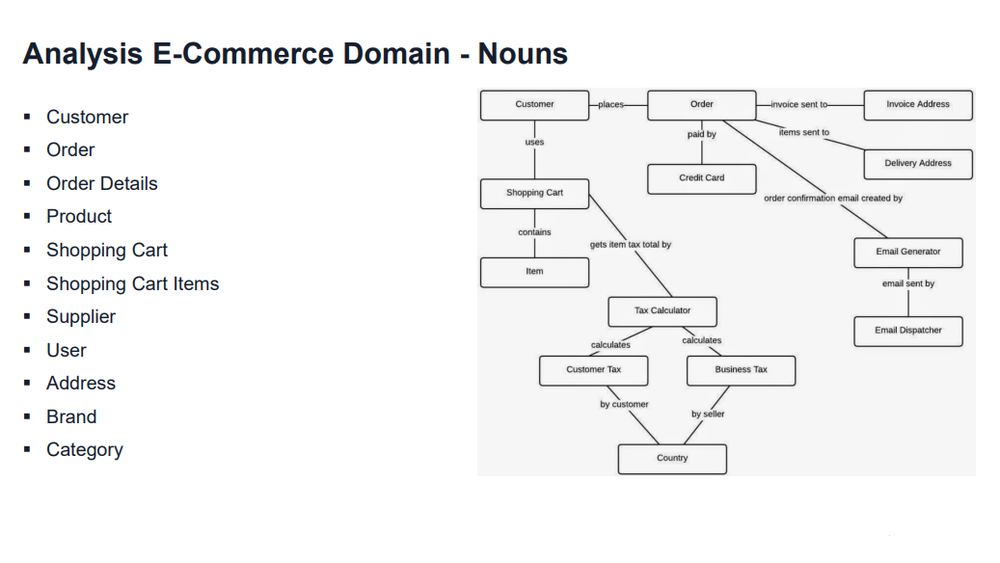

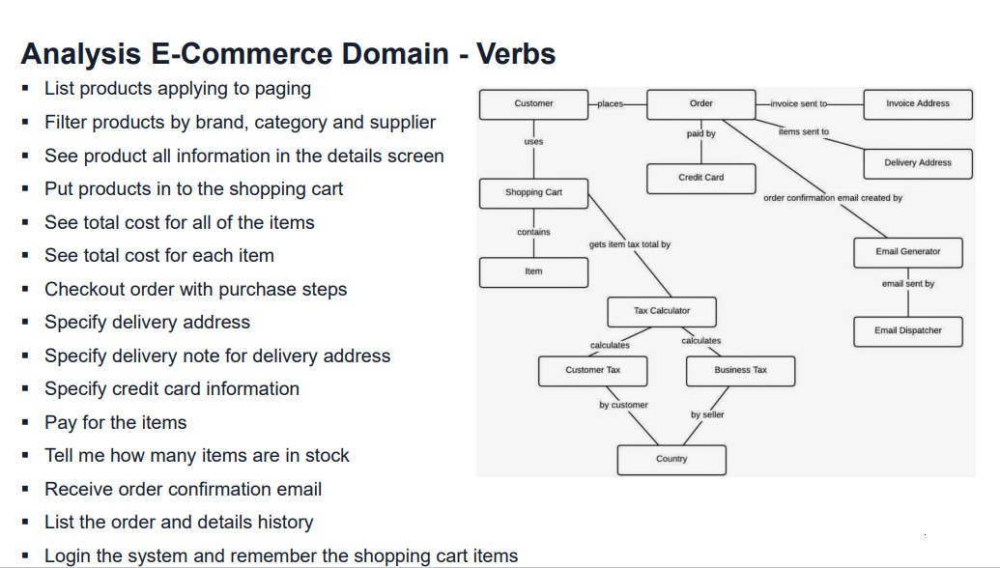

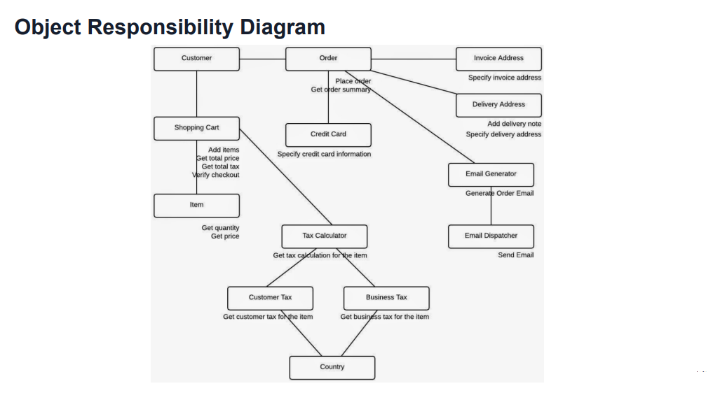

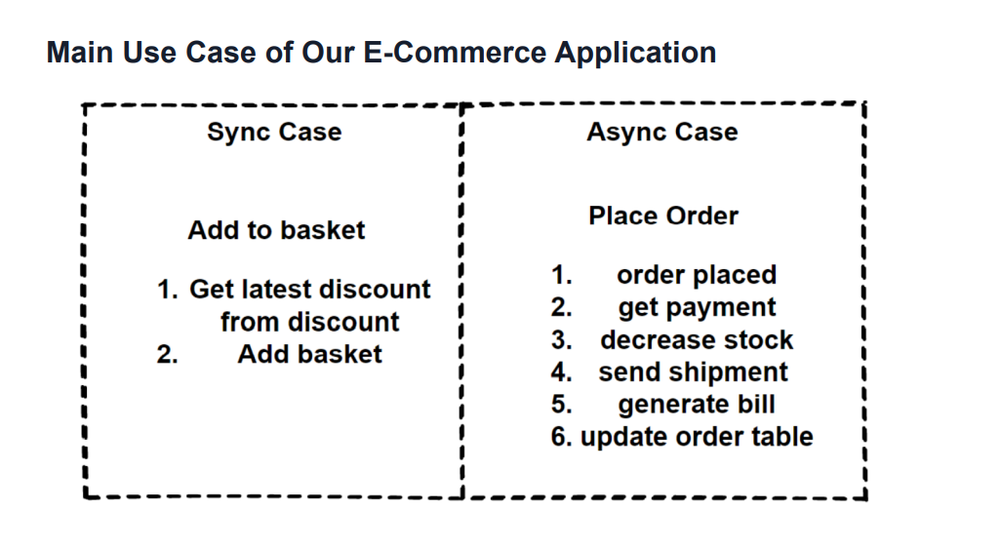

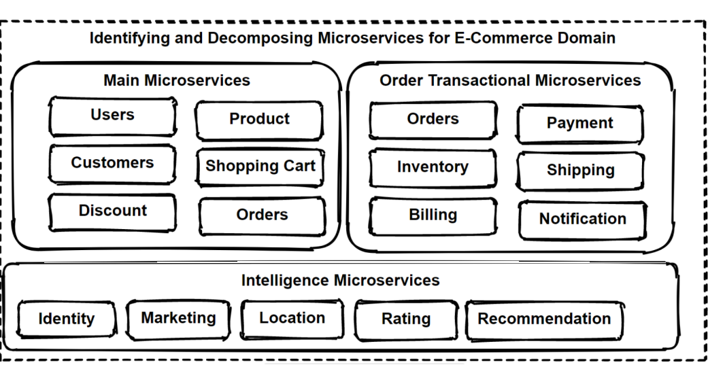


## Pillar 2: Containers

E-Commerce App Design

Containerize application:

- Write Dockerfile
- Build Docker Image
- Run Docker Container
- Test running docker container on local docker env
- Tag Docker Image
- Publish image to a Registry: Docker Hub, AWS ECR
- Configure and Deploy ProductService to AWS AppRunner

## Pillar 3: Container Orchestrators

### Getting Started with Minikube and kubectl

- Getting Started with Minikube and kubectl
- Pods, Deployments, Services, Incress, ConfigMaps, Secrets on Kubernetes using Minikube
- Best Practice for Creating Deployment and Services for Microservices
- Helm Charts - Managing Kubernetes Applications with Helm

### Kubernetes Configuration Best Practices for Containers

- By default, many applications bind to localhost (127.0.0.1) which makes them only accessible from within the container.
- To be accessible from outside the container, your application should bind to 0.0.0.0.
- To resolve the issue, update your application to bind to 0.0.0.0 instead of localhost or 127.0.0.1.
- The process of changing the binding IP address will depend on your application and its configuration.
- For example, in a .NET 7 web application using Kestrel, you can update the Program.cs file to bind to 0.0.0.0.
  Any port which is listening on the default "0.0.0.0" address inside a container will be accessible from the network.

- [Configuration Best Practices of Kubernetes](https://kubernetes.io/docs/concepts/configuration/overview/)
- [Java, NodeJS containers not required, Asp.Net need explicit configure port on Dockerfile or code](https://github.com/dotnet/dotnet-docker/issues/3968)

#### ASP.NET Container Expose Port - CONFIGURE TO LISTEN - 0.0.0.0:8080

- Edit Program.cs
- Build Docker Image
- Run Docker Container
- Test running docker container on local docker env
- Tag Docker Image
- Publish image to a Registry: Docker Hub
- Create Pod Definition k8s/product-pod.yaml
- Create and Apply Deployment on Kubernetes k8s/product-deploy.yaml
- Create and Apply a Service in Kubernetes k8s/product-service.yaml
  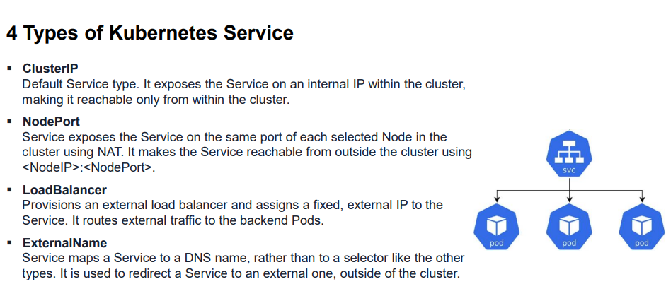
- Combined Way of Creating Deployment and Services for Microservices - product.yaml

### Kubernetes Configuration Best Practices for Containers Continued

- Create Ingress for External Access of Microservice
  When exposing a web application to the internet, you should use an Ingress.
  [Kubernetes documentation of Ingress](https://kubernetes.io/docs/concepts/services-networking/ingress/#what-is-ingress)
- Create ConfigMaps and Secrets for Microservice
- Scale a Container Instance in Kubernetes
- Kubernetes Deploy and Service with Minikube
  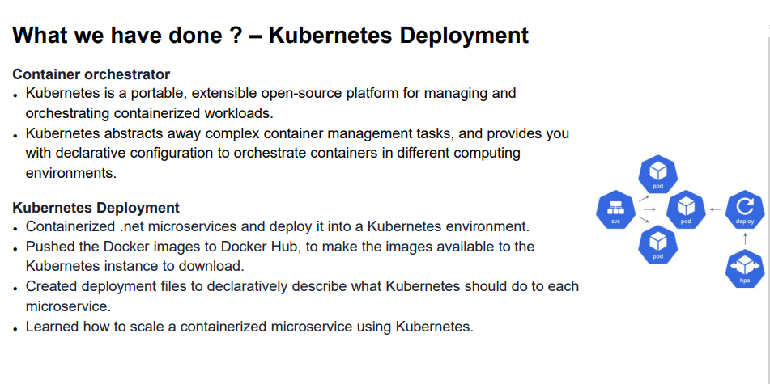

### Helm: Managing Kubernetes Applications with Helm

#### What is Helm and Helm Charts?

Helm is a package manager for Kubernetes (K8s) that simplifies the deployment, scaling, and management of applications. It provides a way to define, install, and upgrade complex Kubernetes applications.

Helm uses a packaging format called Helm Charts. A Helm Chart is a collection of files that describe a related set of Kubernetes resources. These files are written in YAML and describe the application's Kubernetes resources, such as deployments, services, config maps, and secrets.

A single chart might consist of everything needed to deploy something simple, like a memcached pod, or something complex, like a full web app stack with HTTP servers, databases, caches, and so on.

It allows you to automate the deployment of complex applications in a
Kubernetes cluster. Instead of manually creating and managing each component of your application separately, can use a single Helm chart to define all of the components and their relationships. This makes it much easier to manage and update your application over time

For your next steps, you might want to:

- Install Helm and try deploying a Helm Chart
- Learn how to create your own Helm Charts
- Explore the public Helm Chart repository for pre-made charts of common applications

#### What is Artifact Hub for Helm Charts?

Artifact Hub is a web-based platform where Helm users and contributors can publish and share their Helm Charts. It's essentially a marketplace for finding and sharing cloud-native artifacts.

Artifact Hub provides a centralized place for discovering and distributing Kubernetes packages, such as Helm Charts, Operators, and more. It's supported by the Cloud Native Computing Foundation (CNCF) and is the recommended place to find Helm Charts since the deprecation of the Helm stable and incubator repositories.

For your next steps, you might want to:

- Visit Artifact Hub and explore the available Helm Charts
- Learn how to use a Helm Chart from Artifact Hub
- Learn how to publish your own Helm Chart on Artifact Hub

#### How can I search for and install Helm Charts from Artifact Hub?

To search for and install Helm Charts from Artifact Hub, follow these steps:

Visit the Artifact Hub website and use the search bar to find the Helm Chart you want to install.

Click on the Helm Chart you're interested in. You'll be taken to a page with more details about the chart, including installation instructions.

To install a Helm Chart, you typically need to add the chart's repository to your Helm client first. This can be done with the helm repo add command. The command will be provided on the chart's page on Artifact Hub.

```bash
helm repo add <repo-name> <repo-url>
```

After adding the repository, you can install the chart using the helm install command. Again, the exact command will be provided on the chart's page on Artifact Hub.

```bash
helm install <release-name> <repo-name>/<chart-name>
```

Remember to replace <repo-name>, <repo-url>, <release-name>, and <chart-name> with the actual values.

For your next steps, you might want to:

- Check the status of your Helm release
- Learn how to update and manage Helm releases
- Explore other Helm Charts on Artifact Hub deployment

#### How do Helm Charts Work?

[What is a Helm Chart? A Tutorial for Kubernetes Beginners](https://www.freecodecamp.org/news/what-is-a-helm-chart-tutorial-for-kubernetes-beginners/)

Helm Charts work by providing a structured format to define, install, and upgrade Kubernetes applications. Here's a step-by-step explanation:

Chart Creation: A Helm Chart is created as a collection of files inside a directory. The directory name is the name of the chart. It includes a Chart.yaml file that contains metadata about the chart, a values.yaml file that lists the default configuration values, and one or more template files that define Kubernetes resources.

Chart Packaging: The Helm Chart directory is packaged into a versioned chart archive file (.tgz) using the helm package command. This file can be distributed to other Helm users.

Chart Distribution: Packaged Helm Charts can be distributed via a chart repository, which is a basic HTTP server that can serve chart archive files. Users can search for and download charts from these repositories.

Chart Installation: Users can install a Helm Chart using the helm install command. Helm combines the chart and configuration (from values.yaml or provided by the user) to generate a release. A release is an instance of a chart running in a Kubernetes cluster.

Chart Upgrades and Rollbacks: Helm tracks each release and allows users to upgrade the release with new versions of the chart or configuration, or rollback to a previous release.

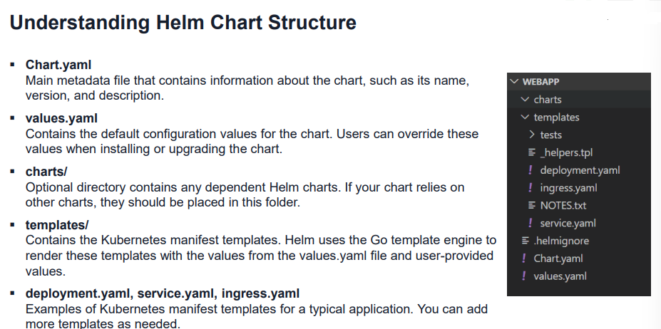

For your next steps, you might want to:

Create your own Helm Chart
Learn how to package and distribute a Helm Chart
Explore how to manage Helm releases, including upgrades and rollbacks

#### Install Helm

See NOTES.md file for information on installing Helm

### Create Helm Chart for ProductService

See NOTES.md for information on creating helm chart for ProductService and running in either:

- Docker Desktop/kubernetes
- MiniKube

## Pillar 4: Cloud-Native Communications

- What are Cloud-Native Communications?
- How microservices communicate in Cloud-Native environments?
- What are patterns & best practices of communications in CN environments?
- API Gateways, Sidecar and Service Mesh Pattern
- Design & Implement our E-Commerce application with Communication Tools

### What are Cloud-Native Communications?

#### 12-Factor App – Cloud-Native Communications

- Processes: Emphasizes that applications should be stateless and share nothing. Encourages apps to use external services for sharing state, which often involves communication between services.
- Port binding: Enables apps to be deployed and scaled independently. By binding to a specific port, an app can expose its functionality as a service, allowing other services to communicate with it without being tightly coupled.
- Concurrency: Promotes scaling applications by running multiple processes concurrently. Communication and coordination between these processes and services become critical.
- Disposability: Fast startup and graceful shutdown for app processes. Services may need to communicate with other components during startup or shutdown to coordinate their actions or update their status.
- Service Mesh: Dedicated infrastructure layer handles service-to-service communication in a cloud-native env. It provides features like load balancing, service discovery, observability, and security.
- Service Discovery: Services need to dynamically discover and communicate with each other. Help to locate and connect to other services within the system.
- API Gateway: Entry point for external requests to the microservices. It routes the requests to appropriate services, handles load balancing, and provides additional functionalities like auth and rate limiting.
- Messaging Systems: Async communication between microservices by using message queues that decouples services, allows to evolve independently and ensures resilience against temporary service failures.

### How microservices communicate in Cloud-Native environments?

Microservices communication types:

- Synchronous communications: Request/Response

Synchronous communication is using HTTP or gRPC protocol for returning synchronous response. 
The client sends a request and waits for a response from the service.

- Asynchronous communications: Message broker event buses

The client sends a request but it doesn't wait for a response from the service.
The client should not have blocked a thread while waiting for a response. 
AMQP (Advanced Message Queuing Protocol)
Using AMQP protocols, the client sends the message with using message broker systems like Kafka and RabbitMQ queue.
The message producer does not wait for a response.
Message consume from the subscriber systems in async way, and no one waiting for response suddenly.
Asynchronous communication also divided by 2:

- one-to-one(queue)

In one-to-one(queue) implementation there is a single producer and single receiver.
Command Patterns offers to receive one queue object and after that execute the command with incoming message. 
This process restarts with receiving new command queue item.

- one-to-many (topic)

In one-to-many (topic) implementation has Multiple receivers. Each request can be processed by zero to multiple receivers. 
Event-bus or message broker system is publishing events between multiple microservices and communication provide with subscribing these events in an async way.
Publish/subscribe mechanism used in Event-driven microservices architecture

Microservices Communication Styles

- Request/response communication with HTTP and REST Protocol (extends gRPC and GraphQL)
gRPC protocol communication mechanisms to provide high performance and low latency
- Push and real-time communication based on HTTP, WebSocket Protocol
Use case about real-time and one-to-many communication like chat application, use Push Model with HTTP and WebSocket Protocols.
Build real-time two-way communication applications, such as chat apps and streaming dashboards like the score of a ports game, with WebSocket APIs.
The client and the server can both send messages to each other at any time. Backend servers can easily push data to connected users and devices.
- Pull communication based on HTTP and AMQP (short polling - long polling)
Also called "Polling" and it's basically the same as refreshing your mail inbox every 5 minutes to check for new mail. It is a call and ask model. This model is become a waste of bandwidth if there are no new messages and responses comes from the server. Opening and closing connections is expensive. And we can say that this model doesn't scale well.
- Event-Driven communication with Publish/Subscribe Mode

### What are patterns & best practices of communications in Cloud-Native environments?

#### Microservices Synchronous Communications and Best Practices

- The client sends a request with using http protocols and waits for a response from the service.
- The synchronous communication protocols can be HTTP or HTTPS. 
- Request/response communication with HTTP and REST Protocol (extends gRPC and GraphQL)
- REST HTTP APIs when exposing from microservices
- gRPC APIs when communicate internal microservices
- GraphQL APIs when structured flexible data in microservices
- WebSocket APIs when real-time bi-directional communication

#### 2 Main Approaches for Public and Backend APIs

- RESTful API Design over HTTP using JSON
- gRPC binary protocol API Design

### API Gateways, Sidecar and Service Mesh Pattern

- API Gateway is a single point of entry to the client applications, sits between the client and multiple backend.
- Similar to the facade pattern from object-oriented design, but it is a distributed system reverse proxy or gateway routing for using in synchronous communication.
- The pattern provides a reverse proxy to redirect or route requests to your internal microservices endpoints.
- API Gateway provides a single endpoint for the client applications, and it maps the requests to internal microservices.
- Provide cross-cutting concerns like authentication, SSL termination, and cache.
- Best practices is splitting the API Gateway in multiple services or multiple smaller API Gateways: BFF-Backend-for-Frontend Pattern.
- Should segregated based on business boundaries of the client applications.

#### Main Features of API Gateway Pattern

- Reverse Proxy and Gateway Routing

Reverse proxy to redirect requests to the endpoints of the internal microservices. Using Layer 7 routing for 
HTTP requests for redirections. Decouple client applications from the internal microservices. Separating
responsibilities on network layer and abstracting internal operations. 

- Requests Aggregation and Gateway Aggregation

Aggregate multiple internal microservices into a single client request. Client application sends a single request 
to the API Gateway and it dispatches several requests to the internal microservices and then aggregates the 
results and sends back to the client application in 1 single response. Reduce chattiness communication.

- Cross-cutting Concerns and Gateway Offloading

Best practice to implement cross-cutting functionality on the API Gateways. Cross-cutting functionalities can be;
Authentication and authorization, Service discovery, Response caching, Retry policies, Circuit Breaker, Rate 
limiting and throttling, Load balancing, Logging, tracing, IP allowlisting

#### Service Registry/Discovery Pattern

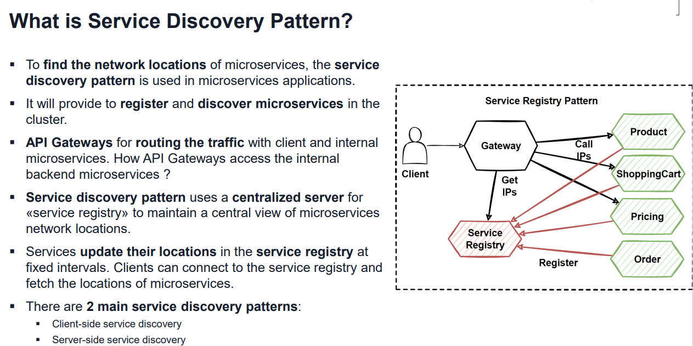

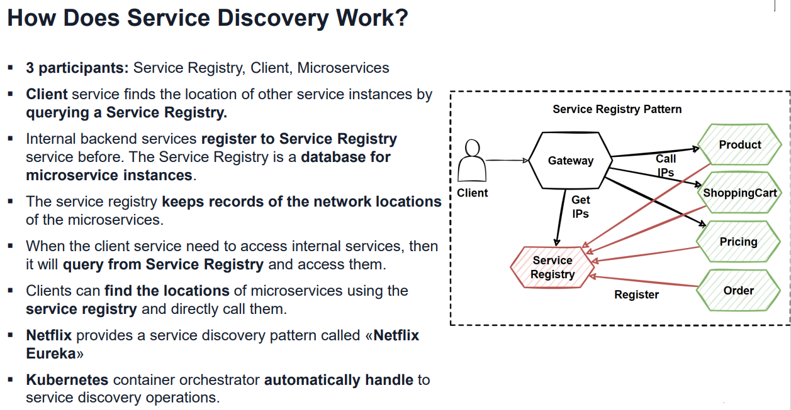

#### Sidecar Pattern

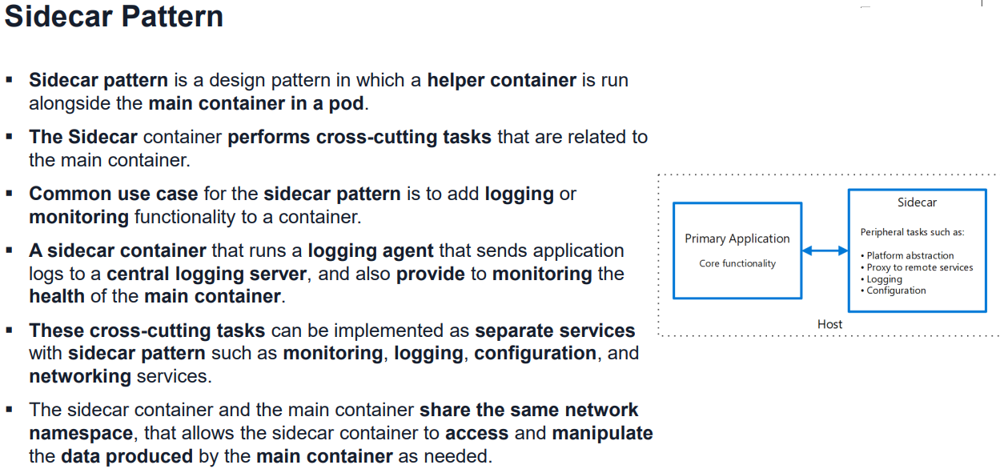

##### Drawbacks of Sidecar Pattern

- Increased complexity - Adding an additional layer of complexity to your deployment, more difficult to understand and troubleshoot issues that rise.
- Increased resource usage - Running an additional container in a pod will increase the resource usage of the pod. 
- Decreased performance - Pod can potentially decrease the performance of the pod, as the sidecar container will be competing for resources with the main container.
- Limited flexibility - Can be inflexible in some cases, as it requires that the main container and the sidecar container run in the same pod.

##### When to use Sidecar Pattern

- When you want to add functionality to an existing container image
- When you want to decouple the main container from the additional functionality
- When you want to run multiple containers in a pod that need to communicate with each other
- When you want to add common functionality to multiple microservices

#### Service Mesh Pattern

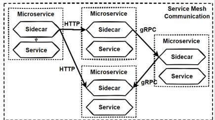

##### What is Service Mesh Pattern?

- Service mesh pattern is managing the communication between microservices in a distributed system. 
- Designed to provide a uniform way to route traffic between microservices, handle load balancing, and monitor the healths.
- Consists of a set of proxy servers (sidecars) that are deployed alongside the microservices. Proxy servers handle the communication between the microservices.
- Responsible for tasks such as routing requests, load balancing, and monitoring the health of the system.
- Abstract away the complexities of managing communication between microservices. 
- Instead of having to manage these details at the application level, use the service mesh to handle them automatically. 
- Popular Service mesh implementations, including Istio and Linkerd, set up and manage a service mesh in a Kubernetes cluster.

##### When to use Service Mesh Pattern

- When you want to abstract away the complexities of managing communication between microservices.
- When you want to centralize the management of communication between microservices.
- When you want to add features such as load balancing, trafficmanagement, and monitoring to your microservices.
- Using a service mesh, can add these features to your microservices without having to modify the microservices themselves.
- Service mesh pattern is a useful tool for managing the communication between microservices in a distributed system. 
- Build and maintain complex microservices-based systems by abstracting away the complexities of managing communication between the microservices.

##### Service Mesh Communication

- Minimizing inter-service communication is ideal.
- Microservice communication: synchronous HTTP and gRPC communication and asynchronous messaging. 
- Service mesh is a dedicated infrastructure layer that manages communication between microservices. 
- Secure the interactions between services without adding complexity to the individual microservices themselves.
- Built-in capabilities for service-to-service communication, resiliency, and handling cross-cutting concerns.
- Communication concerns is moved out of the microservices and into the service mesh layer. 
- This abstraction allows communication to be handled independently from your microservices.
- Support for service discovery and load balancing. Handles traffic management, communication, and networking concerns.

### Design & Implement our E-Commerce application with Communication Tools

#### Communication Tools

- Service Proxy (envoy, nginx, haproxy)
- API Gateway (Kong, krakend, kubeGateway)
- Service Meshes (istio, linkerd, kuma)

#### Examples

AWS Service Proxy - AWS App Mesh is a service mesh that uses Envoy as a proxy, providing application-level networking for microservices on AWS.

AWS API Gateway - AWS API Gateway is a fully managed service for creating, publishing, and managing APIs. It handles features like authentication, rate limiting, and caching.

AWS Service Meshes - AWS App Mesh can also be considered a managed service mesh, as it provides observability, traffic control, and security for microservices running on AWS.

Azure Service Proxy - Azure API Management can act as a service proxy, providing API gateway functionality with load balancing, rate limiting, and caching.

Azure API Gateway - Azure API Management is a fully managed service for creating, publishing, and managing APIs. It provides features like authentication, rate limiting, caching, and monitoring.

Azure Service Meshes - Azure Service Fabric Mesh is a fully managed service mesh for building and deploying microservices. It provides features like service discovery, load balancing, and communication security. Additionally, AKS supports the integration of Istio, Linkerd, and other service meshes.

Istio dominates Service meshes - Service meshes provide service discovery, load balancing, timeouts, and retries, and allow administrators to manage the cluster's security and monitor its performance.

#### Service Mesh

Microservices Architecture

- App should be split into small, independent, and loosely coupled services, each responsible for a specific functionality.
- Allow to develop, deploy, and scale these services independently.

Containerization

- Package your microservices into lightweight containers, which can be easily deployed and managed in a cloud-native environment.

Container Orchestration

- Kubernetes to manage the deployment, scaling, and operation of your containerized microservices. Kubernetes provides features like self-healing, load balancing, and rolling updates.

Istio Service Mesh

- Implement Istio as a service mesh to provide a uniform way to connect, secure, control, and observe microservices. Istio with Envoy proxies, handle traffic management, security, and observability without modifying app code.

#### Ingress

Traffic Management

- Use Istio's traffic management capabilities: load balancing, request routing, and fault injection, to ensure services are highly available and resilient.

Security

- Leverage Istio's built-in security features, including mutual TLS, authorization policies, and authentication, to secure communication between microservices.

Observability

- Utilize Istio's observability features, like distributed tracing, monitoring, and logging, to gain insights into application's performance and identify issues.

Ingress Gateway

- Use an Istio ingress gateway to manage incoming traffic to application, enabling to define routing rules and expose services to the outside world.

#### Design Serverless E-commerce Microservices Architecture with AWS API Gateway, AWS App Mesh

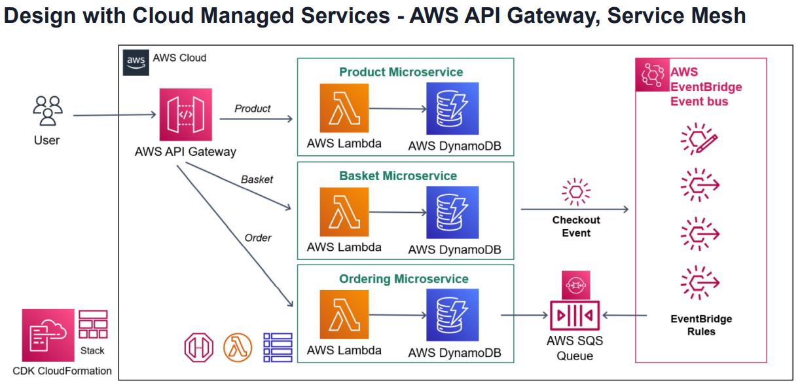

[GitHub Repo](https://github.com/awsrun/aws-microservices)

[Udemy Course](https://www.udemy.com/course/aws-serverless-microservices-lambda-eventbridge-sqs-apigateway/)

##### Managed API Gateway

Microservices Architecture

- Design app as a collection of small, independent, and loosely coupled microservices, each responsible for a specific functionality.

Serverless Compute

- Use serverless compute services like AWS Lambda, Azure Functions, or Google Cloud Functions to host microservices.
- Automatically manage the scaling, patching, and capacity planning of microservices, allows to focus on application logic.

Managed API Gateway

- Utilize managed API Gateway services: Amazon API Gateway, Azure API Management or Google Cloud API Gateway to expose microservices.
- Provide features like request routing, authentication, caching, throttling, and monitoring.

Managed Service Mesh

- Use managed service meshes like AWS App Mesh, Google Cloud Traffic Director, or Azure

Service Mesh

- Integrate with serverless compute services and provide features like traffic routing, load balancing, and end-to-end encryption.

##### Observability

Event-driven Architecture

- Design microservices to be event-driven and use managed services like Amazon EventBridge, Azure Event Grid, or Google Cloud Pub/Sub for asynchronous communication between services.

Data Storage

- Use managed serverless storage services: Amazon DynamoDB, Azure Cosmos DB, or Google Cloud Firestore to store application data.
- Provide low-latency, scalable, and fully managed data storage options.

Security

- Leverage managed Identity and Access Management (IAM) services provided by the cloud providers to control access to microservices and ensure secure communication.

Observability

- Use managed monitoring, logging, and tracing services: Amazon CloudWatch, Azure Monitor, or Google Cloud Operations Suite to gain insights into application's performance and troubleshoot issues.

#### Deploy Microservices to Kubernetes with Service Mesh Istio and Envoy

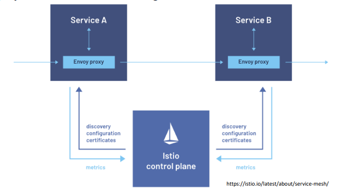

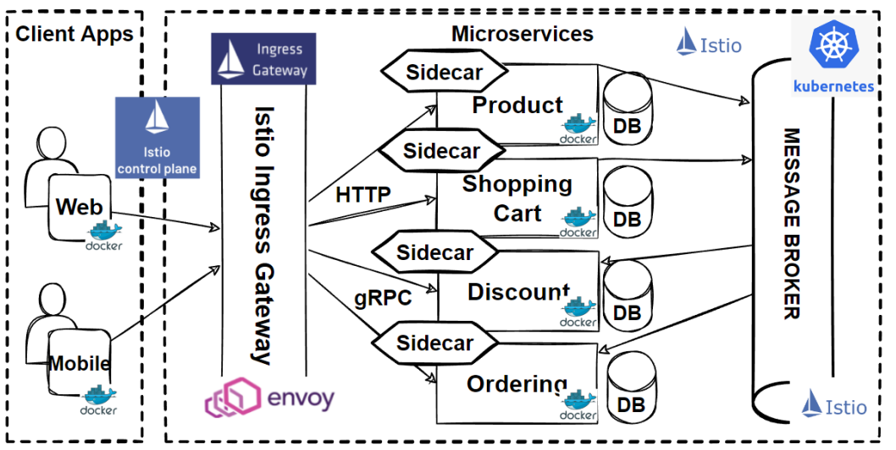

## Pillar 5: Backing Services - Data Management, Caching, Message Brokers

- What are Cloud-Native Backing Services?
- Which Backing Services for Cloud-Native Microservices?
- How microservices use Backing Services in Cloud-Native environments?
- What are patterns & best practices of Backing Services in Cloud-native apps?
- Implement Hands-on Development of Backing Services in Cloud-native microservices

### Backing Services

- K8s Databases (MySQL, Postgres), Serverless Databases
- File storage (NFS, FTP, Cloud Filestore)
- Message Brokers, Enterprise Message Queues, (Kafka, EventBridge)
- Event Streaming Services
- Object Storage: S3, Azure Blob Storage
- AUthenticcation, Authorization Services
- Security Identity Management: AWS IAM, Azure AD
- API Gateways
- Service Meshes
- Distributed Caches, Serverless Caching
- Monitoring and Analytic tools
- Security Identity Services
- Logging services (syslog endpoints, Cloud Logging)
- Search Analytics

Distributed Databases

- Popular databases used in cloud-native apps include relational databases (PostgreSQL, MySQL), NoSQL databases (MongoDB, Cassandra), and in-memory databases (Redis)
- Managed relational databases like Amazon RDS and Google Cloud SQL
- NoSQL databases like Amazon DynamoDB Azure Cosmos DB, and Google Cloud Firestore
- NewSQL or Cloud-native Databases are modern relational database management systems that aim to combine the best features of traditional SQL databases and NoSQL databases. Examples are:  Google Spanner, CockroachDB, VoltDB, TiDB and Vitess

Messaging and Eventing Systems

- Enable asynchronous communication between microservices, allowing to exchange messages or events. This improves scalability and decouples microservices
- Message Brokers such as Apache Kafka, NATS, and RabbitMQ are popular for building event-driven architectures in cloud-native applications
- Cloud Message Brokers - Amazon SQS/SNS, EventBridgeGoogle Cloud Pub/Sub, and Azure Service Bus, Azure Event Hubs

Messaging and Event Streaming

- Managed cloud messaging and event streaming services like Amazon SQS, Amazon SNS, Amazon Kinesis, Azure Service Bus, Azure Event Hubs, or Google Cloud Pub/Sub enable asynchronous communication between microservices

Object Storage

- Managed object storage services: Amazon S3, Azure Blob Storage, or Google Cloud Storage provide highly scalable, durable, and cost-effective storage options for storing and retrieving unstructured data like images, videos

Districtured Caches

- Store frequently accessed data to improve microservice performance and reduce resource-intensive operations like database queries. Redis and Memcached are popular caching systems
- Managed caching services like Amazon ElastiCache, Azure Cache for Redis, or Google Cloud Memorystore provide in-memory data storage for faster data access and reduced latency, improving the performance of microservices

Authentication and Authorization Services

- User authentication and access control management for microservices. Examples include OAuth 2.0, OpenID Connect, and LDAP

Security and Identity Management

- Managed Identity and Access Management (IAM) services provided by the cloud providers help control access to your microservices, secure communication, and manage authentication and authorization

API Gateways

● Load balancing, authentication, rate limiting, and request routing. Examples include Kong, Ambassador, and Amazon API Gateway
● Managed API Gateway services like Amazon API Gateway, Azure API Management, or Google Cloud API Gateway provide request routing, authentication, caching, throttling, and monitoring for your microservices apis

Service Meshes
● Infrastructure layer for managing and controlling communication between microservices, handling tasks like load balancing, service discovery, and observability. Examples of service meshes include Istio, Linkerd, and Kuma

Logging, Monitoring, and Tracing

● Collect, store, and analyze logs and metrics for microservices, helping developers and operators gain insights into performance and troubleshoot issues. Examples Elasticsearch, Logstash, Kibana (ELK stack), Prometheus, and Grafana
● Managed services like Amazon CloudWatch, Azure Monitor, or Google Cloud

Search and Analytics

● Process, analyze, and search large datasets. Elasticsearch is a popular choice for this purpose
● Managed search services like Amazon Elasticsearch, Azure Cognitive Search, or Google Cloud Search provide indexing and searching capabilities for microservices

#### Databases

How to Choose a Database for Microservices?

- Data Consistency Level: Do we need Strict-Strong consistency or Eventual consistency?
- Do we need ACID compliance? Should follow Eventual consistency in microservices to gain high scalability and availability.
- Fixed or Flexible Schema Choise, Predictable or Dynamic Data: Are we work with fixed or flexible schema that need to change frequently, dynamically changed data?
- Are we have Predictable Data or Dynamic Data?
- High or Low Data Volume, Predictable or Un-predictable Data: Are we work with High Volume Data or Low Volume Data?
- Can we have predictable data that we store our microservices database?
- NoSQL Databases prioritize partition tolerance that handling large amount of data or data coming in high velocity
- Read Requirements, Relational or non-Relational Data, Complex Join Queries: Our data is highly structured and requires referential integrity or not required for relationships that is dynamic and frequently changes?
- Should it work with complex queries, table joins and run SQL queries on normalized data models or Retrieve data operations are simple and performs without table joins?
- Deployments, Centralized or De-centralized Structure: Do we deployed to large and one or few locations with centralized structure? or Do we need to deploy and replicate data across different geographical zones?
- High Performance Requirements: Do we need to achieve fast read-write performance?
- High Scalability Requirements: Do we need High Scalability Requirements both vertical and horizontally scaling?
- To accomodate millions of request should sacrifice strong consistency
- High Availability and Low Latency Requirements: Do we need High Availability and Low Latency Requirements that need to separate data across different geographical zones?
- Can we provide ALL OF THESE FEATURES at the same time? Is it possible to provide High Scalability, High Availability and Low Latency with High Performance and able to run Complex Join Queries providing with ACID principles strong data consistency? New SQL Databases offer these features

#### NewSQL Databases: Compare to SQL and NoSQL

| Distinguishing Feature | SQL                 | NoSQL     | NewSQL          |
|------------------------|---------------------|-----------|-----------------|
| Relational             | Yes                 | No        | Yes             |
| ACID                   | Yes                 | No        | Yes             |
| SQL                    | Yes                 | No        | Yes             |
| OLTP                   | Not fully Supported | Supported | Fully Supported |
| Horizontal Scaling     | No                  | Yes       | Yes             |
| Query Complexity       | Low                 | High      | Very High       |
| Distributed            | No                  | Yes       | Yes             |

### Examples of Databases used in Ecommerce Microservice Application

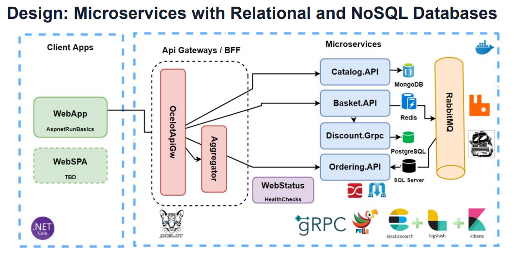


