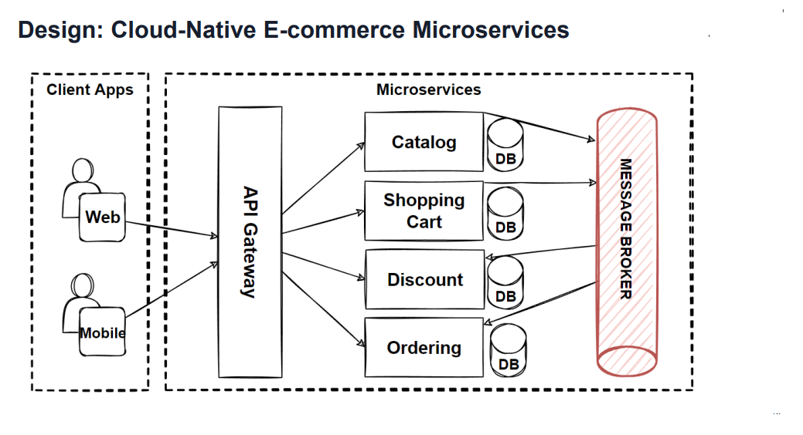

# CloudNative

## Description: Cloud-Native: Microservices, Kubernetes, Service Mesh, CI/CD

[Udemy Course](https://www.udemy.com/course/cloud-native-microservices-kubernetes-service-mesh-cicd/)

[GitHub Repository](https://github.com/mehmetozkaya/CloudNative)

[Medium Article](https://medium.com/design-microservices-architecture-with-patterns)

[Mehmet Ozkaya - Trainer's GitHub Site](https://github.com/mehmetozkaya)

NOTE: Moving Forward, a branch will be created cooresponding to a lecture where new or modified code is added to project. If applicable, the branch will be merged into main.

Example: lecture69 branch created to create microservices/ProductService.csproj

## Kubernetes shortcuts

kubectl cluster-info
kubectl get po -A
kubectl get all

Start with watch pods
kubectl get pod -w
kubectl get pods

## Install Kubernetes Dashboard in Docker Desktop

[Andrew Lock Article (Windows/wsl2 and Install Kube Dashboard)](https://andrewlock.net/running-kubernetes-and-the-dashboard-with-docker-desktop/)

[Teten Nugraha Article (skip login)](https://medium.com/@teten.nugraha/install-kubernetes-dashboard-in-docker-desktop-469a2fb7c87)

[Use Bearer Token to login](https://medium.com/@dijin123/kubernetes-and-the-ui-dashboard-with-docker-desktop-5ad4799b3b61)

## Minikube shortcuts

Following shortcuts used to run instance of Minikube on Windows 11 with Docker Desktop and Kubernetes installed.

- Start Minikube: This command starts a Minikube cluster container using the Docker driver.

```powershell
minikube start --driver=docker
```

- Set the Kubernetes context to Minikube or docker-desktop(kubernetes), use the following command:

```powershell
kubectl config use-context minikube
# TO CHANGE BACK TO docker-desktop version of kubernetes
kubectl config use-context docker-desktop
```

- Verify the installation:

```powershell
minikube status
```

- See dashboard

```powershell
minikube dashboard
```

- Start/Stop Application using yaml file

```powershell
kubectl apply -f product.yaml
kubectl delete -f product.yaml
```

- Access DNS address of application: http://product.local/api/products

- Stop Minikube

```powershell
minikube stop
```

## Pillar 1: Microservices

[Martin Fowlers Microservices Article](https://martinfowler.com/articles/microservices.html)

### Characteristics of a Microservice Architecture:

- Componentization via Services
- Organized around Business Capabilities
- Products not Projects
- Smart endpoints and dumb pipes
- Decentralized Governance
- Decentralized Data Management
- Infrastructure Automation
- Design for failure
- Evolutionary Design

### Understand E-Commerce Domain: Functional Requirements

- List products
- Filter products as per brand and categories
- Put products into the shopping cart
- Apply coupon for discounts and see the total cost all for all of the items in shopping cart
- Checkout the shopping cart and create an order
- List my old orders and order items history

### Understand E-Commerce Domain: User Stories (Use Cases)

- As a user I want to list products
- As a user I want to filter products as per brand and categories
- As a user I want to put products into the shopping cart so that I can check out quickly later
- As a user I want to apply coupon for discounts and see the total cost all for all of the items that are in my cart
- As a user I want to checkout the shopping cart and create an order
- As a user I want to list my old orders and order items history
- As a user I want to login the system as a user and the system should remember my shopping cart items

### Analysis E-Commerce Domain - Nouns and Verbs

- As a user I want to list products
- As a user I want to be able to filter products as per brand and categories
- As a user I want to see the supplier of product in the product detail screen with all characteristics of product
- As a user I want to be able to put products that I want to purchase in to the shopping cart so I can check out
- As a user I want to see the total cost all for all of the items that are in my cart so that I see if I can afford to buy
- As a user I want to see the total cost of each item in the shopping cart so that I can re-check the price for items
- As a user I want to be able to specify the address of where all of the products are going to be sent to
- As a user I want to be able to add a note to the delivery address so that I can provide special instructions
- As a user I want to be able to specify my credit card information during check out so I can pay for the items
- As a user I want system to tell me how many items are in stock so that I know how many items I can purchase
- As a user I want to receive order confirmation email with order number so that I have proof of purchase
- As a user I want to list my old orders and order items history
- As a user I want to login the system as a user and the system should remember my shopping cart items




## Pillar 2: Containers

E-Commerce App Design

Containerize application:

- Write Dockerfile
- Build Docker Image
- Run Docker Container
- Test running docker container on local docker env
- Tag Docker Image
- Publish image to a Registry: Docker Hub, AWS ECR
- Configure and Deploy ProductService to AWS AppRunner

## Pillar 3: Container Orchestrators

### Getting Started with Minikube and kubectl

- Getting Started with Minikube and kubectl
- Pods, Deployments, Services, Incress, ConfigMaps, Secrets on Kubernetes using Minikube
- Best Practice for Creating Deployment and Services for Microservices
- Helm Charts - Managing Kubernetes Applications with Helm

### Kubernetes Configuration Best Practices for Containers

- By default, many applications bind to localhost (127.0.0.1) which makes them only accessible from within the container.
- To be accessible from outside the container, your application should bind to 0.0.0.0.
- To resolve the issue, update your application to bind to 0.0.0.0 instead of localhost or 127.0.0.1.
- The process of changing the binding IP address will depend on your application and its configuration.
- For example, in a .NET 7 web application using Kestrel, you can update the Program.cs file to bind to 0.0.0.0.
  Any port which is listening on the default "0.0.0.0" address inside a container will be accessible from the network.

- [Configuration Best Practices of Kubernetes](https://kubernetes.io/docs/concepts/configuration/overview/)
- [Java, NodeJS containers not required, Asp.Net need explicit configure port on Dockerfile or code](https://github.com/dotnet/dotnet-docker/issues/3968)

#### ASP.NET Container Expose Port - CONFIGURE TO LISTEN - 0.0.0.0:8080

- Edit Program.cs
- Build Docker Image
- Run Docker Container
- Test running docker container on local docker env
- Tag Docker Image
- Publish image to a Registry: Docker Hub
- Create Pod Definition k8s/product-pod.yaml
- Create and Apply Deployment on Kubernetes k8s/product-deploy.yaml
- Create and Apply a Service in Kubernetes k8s/product-service.yaml
  
- Combined Way of Creating Deployment and Services for Microservices - product.yaml

### Kubernetes Configuration Best Practices for Containers Continued

- Create Ingress for External Access of Microservice
  When exposing a web application to the internet, you should use an Ingress.
  [Kubernetes documentation of Ingress](https://kubernetes.io/docs/concepts/services-networking/ingress/#what-is-ingress)
- Create ConfigMaps and Secrets for Microservice
- Scale a Container Instance in Kubernetes
- Kubernetes Deploy and Service with Minikube
  

### Helm: Managing Kubernetes Applications with Helm

#### What is Helm and Helm Charts ?

Helm is a package manager for Kubernetes (K8s) that simplifies the deployment, scaling, and management of applications. It provides a way to define, install, and upgrade complex Kubernetes applications.

Helm uses a packaging format called Helm Charts. A Helm Chart is a collection of files that describe a related set of Kubernetes resources. These files are written in YAML and describe the application's Kubernetes resources, such as deployments, services, config maps, and secrets.

A single chart might consist of everything needed to deploy something simple, like a memcached pod, or something complex, like a full web app stack with HTTP servers, databases, caches, and so on.

It allows you to automate the deployment of complex applications in a
Kubernetes cluster. Instead of manually creating and managing each component of your application separately, can use a single Helm chart to define all of the components and their relationships. This makes it much easier to manage and update your application over time

For your next steps, you might want to:

- Install Helm and try deploying a Helm Chart
- Learn how to create your own Helm Charts
- Explore the public Helm Chart repository for pre-made charts of common applications

#### What is Artifact Hub for Helm Charts?

Artifact Hub is a web-based platform where Helm users and contributors can publish and share their Helm Charts. It's essentially a marketplace for finding and sharing cloud-native artifacts.

Artifact Hub provides a centralized place for discovering and distributing Kubernetes packages, such as Helm Charts, Operators, and more. It's supported by the Cloud Native Computing Foundation (CNCF) and is the recommended place to find Helm Charts since the deprecation of the Helm stable and incubator repositories.

For your next steps, you might want to:

- Visit Artifact Hub and explore the available Helm Charts
- Learn how to use a Helm Chart from Artifact Hub
- Learn how to publish your own Helm Chart on Artifact Hub

#### How can I search for and install Helm Charts from Artifact Hub?

To search for and install Helm Charts from Artifact Hub, follow these steps:

Visit the Artifact Hub website and use the search bar to find the Helm Chart you want to install.

Click on the Helm Chart you're interested in. You'll be taken to a page with more details about the chart, including installation instructions.

To install a Helm Chart, you typically need to add the chart's repository to your Helm client first. This can be done with the helm repo add command. The command will be provided on the chart's page on Artifact Hub.

```bash
helm repo add <repo-name> <repo-url>
```

After adding the repository, you can install the chart using the helm install command. Again, the exact command will be provided on the chart's page on Artifact Hub.

```bash
helm install <release-name> <repo-name>/<chart-name>
```

Remember to replace <repo-name>, <repo-url>, <release-name>, and <chart-name> with the actual values.

For your next steps, you might want to:

- Check the status of your Helm release
- Learn how to update and manage Helm releases
- Explore other Helm Charts on Artifact Hub deployment

#### How do Helm Charts Work?

[What is a Helm Chart? A Tutorial for Kubernetes Beginners](https://www.freecodecamp.org/news/what-is-a-helm-chart-tutorial-for-kubernetes-beginners/)

Helm Charts work by providing a structured format to define, install, and upgrade Kubernetes applications. Here's a step-by-step explanation:

Chart Creation: A Helm Chart is created as a collection of files inside a directory. The directory name is the name of the chart. It includes a Chart.yaml file that contains metadata about the chart, a values.yaml file that lists the default configuration values, and one or more template files that define Kubernetes resources.

Chart Packaging: The Helm Chart directory is packaged into a versioned chart archive file (.tgz) using the helm package command. This file can be distributed to other Helm users.

Chart Distribution: Packaged Helm Charts can be distributed via a chart repository, which is a basic HTTP server that can serve chart archive files. Users can search for and download charts from these repositories.

Chart Installation: Users can install a Helm Chart using the helm install command. Helm combines the chart and configuration (from values.yaml or provided by the user) to generate a release. A release is an instance of a chart running in a Kubernetes cluster.

Chart Upgrades and Rollbacks: Helm tracks each release and allows users to upgrade the release with new versions of the chart or configuration, or rollback to a previous release.


For your next steps, you might want to:

Create your own Helm Chart
Learn how to package and distribute a Helm Chart
Explore how to manage Helm releases, including upgrades and rollbacks

#### Helm Charts
